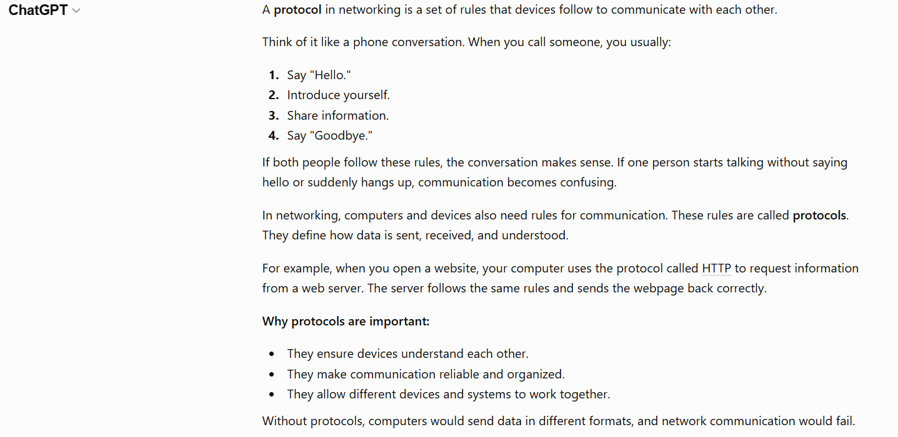
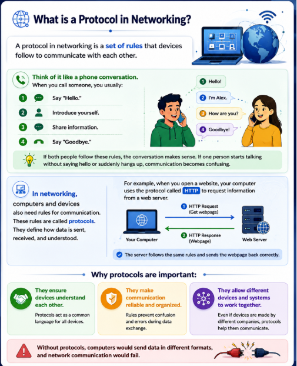
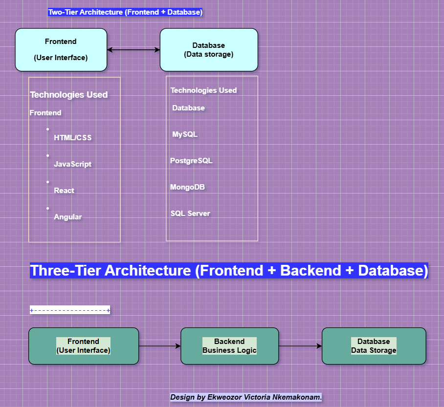
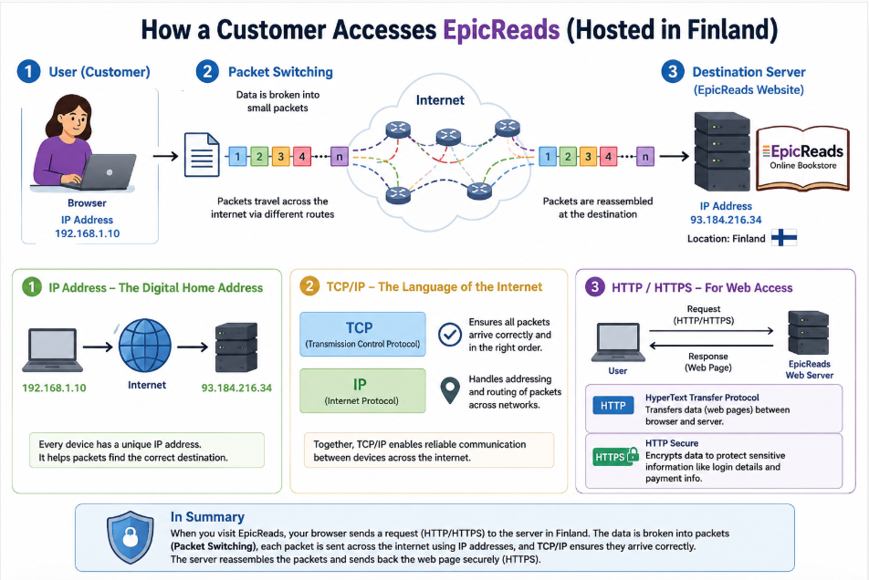
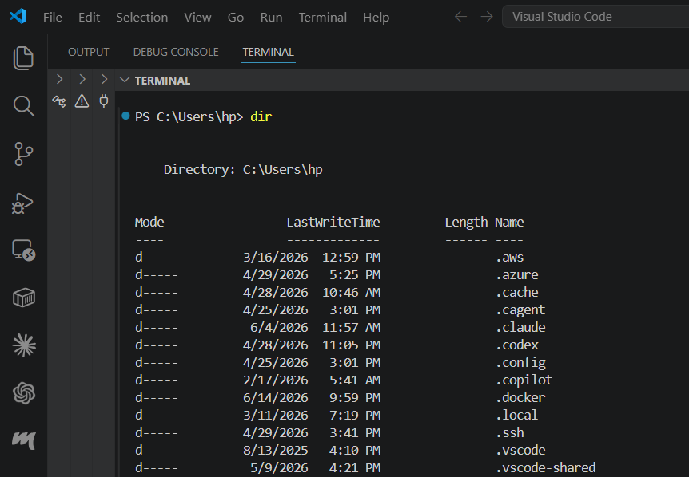

# Week 00 - Internet and Networking

Part of the DevOps Micro Internship (DMI) Cohort 3 with Agentic AI

---

# 🧑‍💻 Task 1: Using ChatGPT as Your Learning Assistant

## Scenario

You're new to DevOps and will frequently encounter technical questions. ChatGPT can be your learning companion.

## Your Task

Write a clear ChatGPT prompt to help you understand:

> "What is a protocol in networking? Explain with a simple real-life example."

Take a screenshot of your interaction showing:

* Your detailed prompt (with clear expectations)
* ChatGPT's simplified response with an example

## Screenshot

Save your screenshot in the `screenshots` folder and update the file name below.




Replace `task-1-chatgpt.png` with your actual screenshot file name.

---

## What I Learned (2–3 lines)

I learned that networking protocols are sets of rules that enable devices to communicate effectively and understand each other.
The phone conversation example helped me understand how protocols create a structured and reliable communication process.
I also learned that protocols such as HTTP are essential for exchanging data between computers and web servers. 


---

# 🌐 Task 2: Internet and Networking

## Scenario

Your friend is launching an online bookstore named **EpicReads**.

He asked you to explain how users globally can access his website hosted in Finland.

## Your Task

Write a short explanation (**100–150 words**) that includes:

* Packet Switching
* IP Address
* TCP/IP
* HTTP/HTTPS

💡 **Tip:** You may use ChatGPT (as demonstrated in Task 1) to refine your explanation.

## Answer

When a user visits a website, data is sent across the internet using packet switching. This process breaks information into small packets that travel through different routes and are reassembled at the destination. Each device on the internet has an IP address, which acts like a unique identifier and helps direct packets to the correct location.
Communication between devices is managed by TCP/IP. TCP (Transmission Control Protocol) ensures that data arrives accurately and in the correct order, while IP (Internet Protocol) handles addressing and routing.
Web browsers use HTTP (HyperText Transfer Protocol) to request and receive web pages. HTTPS is the secure version of HTTP, encrypting data exchanged between the user and the website. This protects sensitive information such as passwords, personal details, and payment information from unauthorized access.


---

# 🏗️ Task 3: Application Architecture & Stack

## Scenario

EpicReads bookstore has two application versions:

### Two-Tier Application

* Frontend
* Database

### Three-Tier Application

* Frontend
* Backend
* Database

## Your Task

* Draw simple diagrams (hand-drawn or tool-based such as draw.io)
* Label each layer clearly
* List at least two common technologies or tools used for each layer
* Submit a screenshot or photo clearly showing your own drawing

## Diagram Screenshot / Photo

Save your diagram image in the `screenshots` folder and update the file name below.




Replace `task-3-diagram.png` with your actual diagram file name.

---

## Technologies Used

### Frontend

* HTML/CSS
* JavaScript
* React
* Vue.js

Frontend: The part users interact with, such as the EpicReads website pages.


### Backend

* Node.js
* Java Spring Boot
* Python Django
* PHP Laravel.

Backend: Processes requests, handles business logic, and communicates with the database.

### Database

* MySQL
* PostgreSQL
* MongoDB
* Oracle Database.

Database: Stores books, customer accounts, orders, and other information.

This task helped me understand the difference between two-tier and three-tier application architectures. 
I learned that the frontend handles user interaction, the backend manages business logic, and the database stores application data. 
The three-tier architecture provides better scalability, security, and maintainability than the two-tier model.

---

# 🌍 Task 4: Domain Name & DNS (Basic Concepts)

## Scenario

Your friend's bookstore **EpicReads** is currently accessible through:

```text
52.172.142.222:3000
```

He purchased the domain:

```text
epicreads.com
```

## Your Task

In **50–100 words**, explain in your own words:

1. What is DNS (Domain Name System)?
2. Which DNS record type should be used to connect the domain to the given IP, and why?

## Answer

DNS (Domain Name System) is like the internet’s phonebook. It translates human-friendly domain names like epicreads.com into machine-readable IP addresses such as 52.172.142.222, so users don’t need to remember numbers.
To connect the domain to the server.
An A record should be used. An A record maps a domain name directly to an IPv4 address. In this case, it will point epicreads.com to 52.172.142.222, allowing users to access the bookstore using the domain instead of the IP address and port.


---

# 💻 Task 5: Visual Studio Code Setup (Hands-on)

## Your Task

Install Visual Studio Code (if not already installed).

Take a screenshot of your VS Code environment showing:

* Terminal open inside VS Code
* Running a basic command:

### Windows

```powershell
dir
```

### Linux / macOS

```bash
pwd
ls
```

* Your selected VS Code theme clearly visible

⚠️ **Important:** The screenshot must show your username or another identifiable detail to confirm it is your environment.

## Screenshot

Save your screenshot in the `screenshots` folder and update the file name below.




Replace `task-5-vscode.png` with your actual screenshot file name.

---

# 🔗 Task 6: Publish Your Assignment as a LinkedIn Post

## Objective

Publishing on LinkedIn helps you:

* Build your professional online presence
* Reinforce your learning
* Document your DevOps journey publicly

## Your Task

Summarize your answers from Tasks 1–5 into a LinkedIn post.

Clearly structure your post into the following sections:

* ChatGPT
* Internet & Networking
* App Architecture
* DNS
* VS Code Setup

Add the following credit note at the end of your post:

> **P.S. This post is a part of DevOps Micro Internship with Agentic AI Cohort-3 by Pravin Mishra. You can start your DevOps journey by joining this Discord community: https://discord.pravinmishra.com/**

---

## LinkedIn Post URL

Paste your LinkedIn post URL here:

```text
https://www.linkedin.com/posts/ekweozor_devops-dmi-cloudadvisory-share-7473688780982554624-nKRR/?utm_source=share&utm_medium=member_desktop&rcm=ACoAAEFzwtYB-RXnYG13TMOIwtIDL3APbwSz4XI
```

---

## LinkedIn Post Backup Copy

Paste the full text of your LinkedIn post here:

I have just completed my Week 0 assignment, which covered Internet fundamentals, networking, application architecture, DNS, and developer tools setup, as part of the DevOps Micro Internship by Pravin Mishra (CloudAdvisory).
This week helped me connect theory with real-world systems, especially how web applications actually work behind the scenes.

What I found easy:
Understanding how data travels across the internet using packet switching, TCP/IP, and HTTPS was very clear and relatable.

⚙️ What I found difficult:
Grasping application architecture layers (Frontend, Backend, Database) and how they interact in real systems took more time to understand fully.

📈 What I will improve next week:
I want to get more hands-on practice with tools like Docker and improve my understanding of backend systems and deployment workflows.
Overall, this week built a strong foundation in how the internet and web applications work.

If you want to learn DevOps for real, DMI Cohort 3 starts on 27th June, and if you want to build real DevOps skills, apply here 👇 following this link: https://lnkd.in/eVA8HQjt

#DevOps #DMI #CloudAdvisory #Networking #Docker #LearningJourney #TechGrowth

---

# Reflection – Week 0

### What did you find easy?

I found it easy to understand the difference between two-tier and three-tier application architectures. Learning the roles of the frontend, backend, and database helped me see how modern web applications are structured.

---

### What was difficult?

Understanding networking concepts such as packet switching, TCP/IP, and how data travels across the internet was more challenging at first. It took some extra reading and examples before everything started to make sense.

---

### What will you improve next week?

Next week, I want to spend more time practicing with DevOps tools and applying what I learn through hands-on exercises. I also want to strengthen my understanding of networking concepts and become more confident using the command line and development tools.

---

## 📌 About DMI & CloudAdvisory

DevOps Micro Internship (DMI) is a project-based DevOps program run by Pravin Mishra (The CloudAdvisory) focused on real-world execution, systems thinking, and career readiness.

It helps learners build strong DevOps foundations with hands-on experience.


## 📌 Resources

- 🌐 **DMI Official Website:** https://pravinmishra.com/dmi  
- 🎓 **DevOps for Beginners (Udemy):** https://www.udemy.com/course/devops-for-beginners-docker-k8s-cloud-cicd-4-projects/  
- 🎓 **Ultimate Agentic AI DevOps with Clude Code** https://www.udemy.com/course/ultimate-agentic-ai-devops-with-claude-code/?referralCode=448389767BC96284087B
- 🎓 **DevOps with Claude Code: Terraform, EKS, ArgoCD & Helm** https://www.udemy.com/course/devops-with-claude-code-terraform-eks-argocd-helm/?referralCode=1C5B734505D65A010FA3
- ▶️ **YouTube Playlist (DMI Cohort 3):** https://www.youtube.com/playlist?list=PLFeSNDtI4Cho  
- 🔗 **Pravin Mishra (LinkedIn):** https://www.linkedin.com/in/pravin-mishra-aws-trainer/  
- 🏢 **CloudAdvisory (LinkedIn):** https://www.linkedin.com/company/thecloudadvisory/

---

*This submission is part of DevOps Micro Internship (DMI) Cohort 3 — Agentic AI Track*