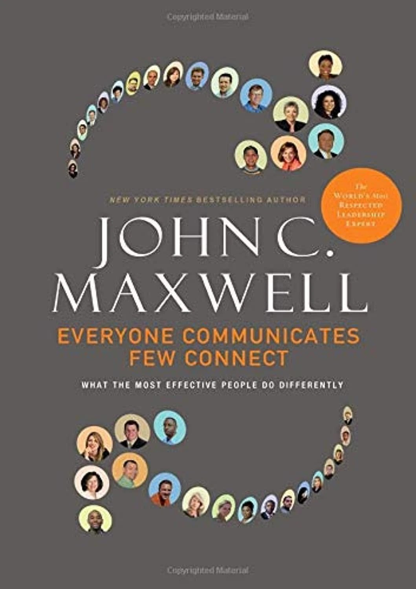
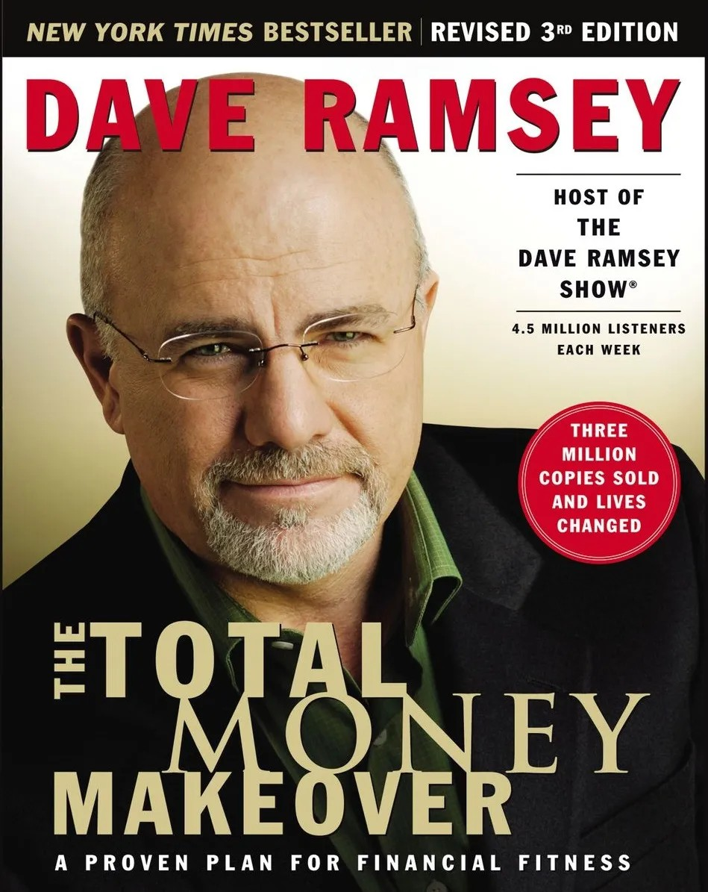
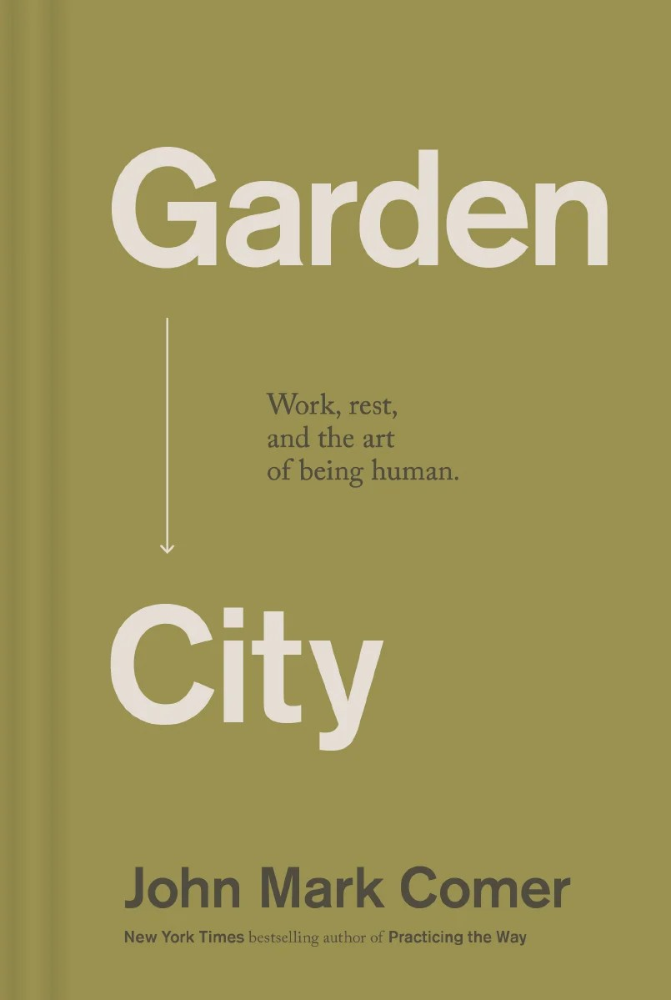
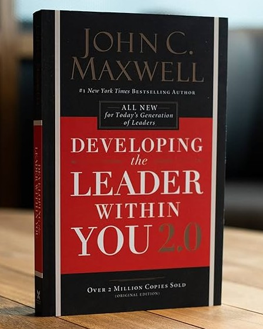
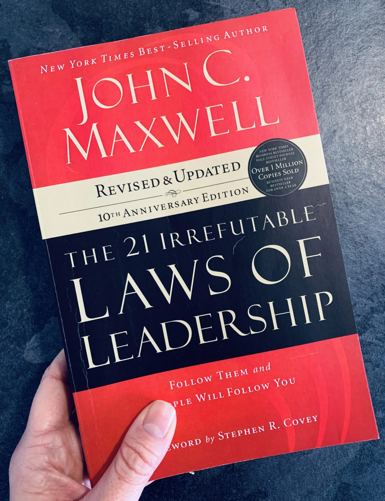

# Week 01 — Success Mindset (Mindset OS)

Part of the DevOps Micro Internship (DMI) Cohort 3 with Agentic AI

---

## Purpose (Read This First)

This week is not motivation homework.

This is you building your **Mindset OS** — the system you will use for the next 5 months (and honestly, for years).

### Expectations

* Be honest.
* Be specific.
* Be practical.
* Write like an adult professional: clear sentences, no one-liners.

You will reuse this in later weeks. So do it properly once.

---

# Assignment 1. What is something you believe to be true that most people around you would disagree with?

### Rules

* No "safe" answers
* Must be your real belief (not copied from internet).
* Minimum 50 words.

**Hint:** What do you believe about career, money, learning, discipline, relationships, health, success, life, tech industry, etc. that most people don't agree with?

## Answer

One belief I hold that many people around me may disagree with is that learning should never stop. I believe the only time a person truly stops learning is when they are no longer alive. While formal education and certificates are valuable, they should never become the limit of a person's growth. Learning can happen through books, mentors, practical experience, technology, and even everyday life. To me, continuous learning is a decision, not something determined by age, background, or when someone started. I believe success is not determined by how early or late someone begins, but by the mindset they choose to develop.

This belief is one of the reasons I continue to invest in myself and embrace opportunities to grow, such as joining the DMI DevOps Micro Internship. I see opportunities like this as more than technical training, they are reminders that people who are willing to learn can continue to reinvent themselves and build skills that create lasting value.

As I grow in DevOps, I understand that technology changes constantly. Staying relevant requires discipline, consistency, and the humility to keep learning. I believe discipline is more dependable than motivation because it keeps you moving even when motivation fades. I also believe that building value is more important than chasing quick money, because value creates opportunities, trust, and long-term success. In a world where AI and technology continue to evolve, I believe those who commit to lifelong learning will always find ways to adapt, contribute, and remain valuable.

---

# Assignment 2. What are the top 3 objective truths you discovered through experimentation and results?

### Definition

Objective truths do not depend on opinions. They hold true regardless of how people feel.

Write each truth in this format:

**Truth:** (1 sentence)

**Evidence from my life:** (2–4 lines: what you tried + what happened)

---

## Truth #1

### Truth

## Truth #1 Continuous learning and deliberate practice produce measurable growth.

### Evidence from my life

During my IT Support training, I struggled with some topics and almost gave up, but I committed to studying beyond the classroom. During a HubSpot website design tutorial, I was able to help an alumni facilitator solve several challenges because of what I had learned through self-study. She then encouraged other students to come to me whenever they needed help with HubSpot, showing me that consistent learning produces real competence and trust.

---

## Truth #2

### Truth 2

The right guidance can positively change the direction of a person's life.

### Evidence from my life

I encouraged one of my university coursemates, who was working as an Uber driver, to consider building a career in tech instead of giving up on his professional growth. I stayed in touch, helped him overcome the challenge of balancing work and learning by showing him how to manage his time, and today he is progressing in his tech journey while still supporting himself through his job.

---

## Truth #3

### Truth 3

A change in mindset leads to different decisions, and different decisions produce different results.

### Evidence from my life

After graduation, I spent over four years away from my career while running a business. Reading Why You Act the Way You Do by Tim LaHaye, along with other personal development books, challenged the way I thought about growth and purpose. That shift in mindset influenced my decision to return to technology, invest in my skills, and continue building my career through IT Support and now DevOps.

---

# Assignment 3. What does your 2.0 version look like?

### Instructions

Write as if a journalist is writing about you **3 to 7 years from now** (not 20 years).

**Minimum 300 words.**

### Rules

* Write in past tense, like it already happened.
* Don't use "likes to / wants to / hopes to."
* Use specifics:

  * built
  * shipped
  * led
  * published
  * earned
  * relocated
  * contributed
* Include skills proof:

  * projects
  * portfolios
  * GitHub
  * blogs
  * certifications
  * job role
  * leadership
  * community contribution
* Add 1–3 images if you can (optional but powerful).

### Publish It Publicly On Any ONE

* LinkedIn
* Medium
* WordPress
* Blogspot
* Personal blog
* Portfolio page

Include this line:

> **P.S. This post is a part of DevOps Micro Internship with Agentic AI Cohort-3 by [Pravin Mishra](https://www.linkedin.com/in/pravin-mishra-aws-trainer/). You can start your DevOps journey by joining this [Discord community](https://discord.pravinmishra.com/) ( https://discord.pravinmishra.com/ ).**

## Your Article

# **This Is the Life I'm Building.**

### *A journalist's look at my life 3–7 years from now.* 

Few people would have imagined that the woman who once questioned whether she truly belonged in technology would one day become a trusted DevOps & Cloud Engineer, mentor aspiring professionals, and speak on global stages. Yet that transformation did not happen overnight. It began with one decision—to never stop learning.

Over the years, **Ekweozor Nkemakonam Victoria** established herself as a respected **DevOps & Cloud Engineer** and a trusted **DevOps & Cloud Consultant**, known for delivering reliable cloud solutions and helping organizations automate, scale, and modernize their technology infrastructure. She earned industry-recognized AWS certifications and strengthened her expertise through hands-on experience, believing that true competence is built through consistent practice before certification.

Her GitHub portfolio became a reflection of her journey, showcasing real-world DevOps and cloud projects involving Linux, Git, Docker, Kubernetes, Infrastructure as Code, CI/CD pipelines, AWS cloud deployments, and **Agentic AI** solutions. Rather than building projects simply to complete a portfolio, she built solutions that solved real business problems and demonstrated practical engineering skills.

She also published technical articles documenting her learning journey, project experiences, lessons learned, and practical insights from working with DevOps, Cloud, and Agentic AI. Through LinkedIn, technical blogs, and other professional platforms, she consistently shared knowledge that made complex concepts easier for beginners to understand. Her willingness to teach, encourage, and give back earned her the respect of both peers and aspiring professionals.

Beyond her technical achievements, Victoria became known for mentoring people who were transitioning into technology. She invested time in reviewing projects, sharing learning resources, encouraging beginners, and helping others believe that it was never too late to build a meaningful career in tech. Her passion for developing people eventually led her back to the DMI community, where she contributed as a mentor, helping future cohorts navigate the same journey she had once started.

Her work expanded into FinTech, cloud consulting, and organizations solving real-world problems. She contributed to cloud modernization initiatives, improved deployment processes, built secure and scalable infrastructure, and collaborated with international teams to deliver solutions that created measurable business value. Her expertise opened opportunities to work across global environments, allowing her to continue learning while making meaningful contributions to every team she joined.

As her influence grew, Victoria was invited to speak at technology events, leadership forums, and global conferences. She shared more than technical knowledge; she shared the values that shaped her journey—discipline, continuous learning, integrity, and the importance of creating value before seeking recognition. She became known for delivering excellence with humility, and colleagues consistently described her as someone who always delivered and always taught them something valuable.

More than her certifications, projects, or professional titles, Victoria's greatest legacy became the lives she impacted. She never stopped learning, built opportunities through technology, and helped others grow with integrity.

Looking back, this journey was never built in a single breakthrough. It was built one day, one lesson, one project, and one act of discipline at a time. She chose consistency over convenience, growth over comfort, and service over self. Those daily choices quietly shaped a life that once existed only as a vision.

This article is more than a picture of the future. It is a commitment to the standards Victoria chose to live by: continuous learning, discipline, integrity, and creating value through technology. Every achievement described here represents a direction she intentionally pursued. She looked forward to reading these words again in a few years, not to admire what she had written, but to reflect on how faithfully she pursued this vision and how much of it had become reality.

### Public Link

https://www.linkedin.com/posts/ekweozor_devops-cloudengineering-aws-ugcPost-7477799203977637888-pf7S/?utm_source=share&utm_medium=member_desktop&rcm=ACoAAEFzwtYB-RXnYG13TMOIwtIDL3APbwSz4XI

`__________________________`

---

# Assignment 4. Have you ever cut corners (unethical / dishonest / shortcut behavior — not necessarily illegal)? If yes, how did it make you feel?

### Important

You don't need to write the full story.

Focus on the feeling:

* guilt
* fear
* shame
* stress
* regret
* numbness
* etc.

This is about self-awareness, not judgment.

### Answer Format

**Yes / No**

If Yes:

**What emotion did you feel?** (minimum 50–100 words)

## Answer

Yes, I have cut corners before. During my school days, there were times when I allowed a friend to complete and submit an assignment on my behalf because I was unavailable. At the time, I was more concerned about meeting the deadline than the learning opportunity. Looking back, I regret that decision because I missed the chance to develop my own understanding. That experience taught me that shortcuts may save time temporarily, but they also limit personal growth. Today, I choose to do my own work because every assignment is an opportunity to learn, improve, and build genuine competence.

---

# Assignment 5. What are 10 non-fiction books you plan to read in the next 1 year?

### Rules

* Mention **Title + Author**
* Any language allowed
* No fiction novels

### Tip

Choose books that improve:

* mindset
* communication
* productivity
* health
* money
* career
* leadership

## Book List

1. ATOMIC HABITS BY JAMES CLEAR 

2. THE 15 INVALUABLE LAWS OF GROWTH BY JOHN C. MAXWELL 

3. THE DANIE PLAN BY RICK WARREN 

4. THE 5AM CLUB BYROBIN SHARMA  

5. EVERYONE COMMUNICATES, FEW CONNECT BY JOHN C. MAXWELL 

6. THE TOTAL MONEY MAKEOVER BY DAVE RAMSEY 

7. GARDEN CITY BY JOHN MARK CORNER 

8. DEVELOPING THE LEADER WITHIN YOU 2.0 JOHN C. MAXWELL 

9. THE 21 IRREFUTABLE LAWS OF LEADERSHIP BY JOHN C. MAXWELL 

10. THE PSYCHOLOGY OF MONEY BY MORGAN HOUSEL 

---

# Assignment 6. What are the things you will measure regularly in your life and career?

### Rules

List topics only. No need to share numbers.

### Must Include

* Learning / skill
* Output / proof
* Health / energy
* Time / focus
* Money / finance (personal or business)

### Example

* Learning hours per week
* Deep work sessions per week
* Projects shipped / documented
* Steps / workouts
* Sleep hours
* Spending tracker

## My Metrics

* 
* CONTINUOUS LEARNING (DEVOPS, CLOUD AND AGENTIC AI)
* READING AND PERSONAL DEVELOPMENT 
* GITHUB PROJECTS AND PORTFOLIO GROWTH 
* PROFESSIONAL CERTIFICATIONS 
* DAILY STUDY HOURS AND DEEP WORK
* NETWORKING, MENTORSHIP, AND MENINGFULM RELATIONSHIPS.
* PRAYER, SPIRITUAL GROWTH, AND CHARACTER DEVELOPMENT.
* HEALTH, EXERCISE, SLEEP, AND ENERGY.
* TECHNICAL BLOGS AND LINKEDIN CONTENT.

---

# Assignment 7. Brain Dump + 5-Month System Plan

## Step 1: Brain Dump (Private)

Do a brain dump of everything in your mind into a notebook.

Examples:

* Bills
* Tasks
* Worries
* Goals
* Pending messages
* Ideas
* Responsibilities

### Did You Do It?

**Yes / No**

Answer:

YES.

---

## Step 2: Your 5-Month Routine + Focus Blocks

Create a simple plan you can realistically follow for the next 5 months.

### Weekly Routine

Example:

* Mon–Thu: 60 min deep work
* Sat: DMI session
* Sun: Weekly review

#### My Weekly Routine

Monday–Friday: Dedicate at least 2 hours to learning DevOps, Cloud, and Agentic AI through studying, hands-on practice, and completing DMI assignments.
Once or twice a week: Spend 5–6 hours managing my business while still making time for my DMI learning.

Saturday: Attend the DMI live session and take time to rest and recharge afterward.

Sunday: Attend church, reflect on the past week, read, and plan my goals for the coming week.

---

### Focus Blocks

#### When Will You Do DMI Work? (Days + Time)

Monday–Friday: 7:30 AM – 9:30 AM

Business days: Study at a flexible time that fits my business schedule.

#### How Many Sessions Per Week?

At least 5 focused learning sessions each week, with additional practice whenever my schedule allows.

---

### Distraction Rules

Examples:

* Phone rules
* Social media rules
* Environment setup

#### My Distraction Rules

Keep my phone away during study sessions.

Check social media only after completing my daily learning goals.

Study in a quiet environment whenever possible.

Avoid procrastination by starting tasks immediately, even if only for a few minutes.

Prepare my learning materials before each study session to stay focused.

---

# Reflection – Week 1

### Biggest insight I got about myself this week
This week confirmed something I had been discovering about myself, I genuinely enjoy learning. 
The more I study DevOps, Cloud, and Agentic AI, the more excited I become about the journey. 
I no longer see learning as an obligation but as an investment in the future I am intentionally building

### My biggest weakness/loop I noticed

I noticed that procrastination, spending unnecessary time on my phone, and occasional self-doubt can slow my progress. 
I also realized that getting started is usually the hardest part, but once I begin, I stay focused and enjoy the learning process.

### One system I will implement from this week (exact habit + time)

Every weekday at 7:30 AM, I will begin my DevOps study session by putting my phone away, 
reviewing my daily learning goals, and studying for two uninterrupted hours before checking social media or responding to personal messages.

### LinkedIn Post

Dialog content start.
Create post modal

📘 My DevOps Growth Journal | DMI Cohort 3

When I joined the DevOps Micro Internship with Agentic AI Cohort 3, I thought I was simply learning DevOps and Cloud technologies. As I worked through each assignment, I realized I was building something much bigger.

Every assignment challenged me to reflect on my beliefs, strengthen my mindset, develop discipline, build systems, define my values, and intentionally document my growth not only as a future DevOps & Cloud Engineer but also as a person.

Instead of letting these lessons remain scattered across individual assignments, I decided to document them in one place My DevOps Growth Journal | DMI Cohort 3.

This journal is more than a collection of completed assignments. It is a personal record of my learning journey, technical growth, mindset shifts, reflections, and the systems I am building to become a better engineer, leader, and lifelong learner.

My goal isn't just to complete this internship, it's to become the kind of DevOps & Cloud professional who never stops learning, creates value, and helps others grow.

One lesson has remained constant throughout this journey:

Growth doesn't happen by accident. It happens through the right mindset, continuous learning, discipline, and consistent action. Every assignment has reminded me that becoming a better engineer also means becoming a better thinker, learner, leader, and problem solver.

I'm so grateful to Pravin Mishra, co- lead mentor Anjana Muthunayake, and co-mentors Joy Ukpabi, Greg Odi, Nkechi Anna Ahanonye, Faith Samson, and Tanisha Borana for creating an environment that develops not only technical skills but also character, mindset, and personal growth.

This journal marks the beginning of a journey I am intentionally building, and I look forward to documenting every lesson, every project, every challenge, and every milestone as I continue growing in DevOps, Cloud, and Agentic AI. Learning never stops. Growth is intentional.

#DevOps #CloudEngineering #AWS #AgenticAI #ContinuousLearning #CareerGrowth #Mentorship #DMI #DevOpsMicroInternship #CareerGrowth #Mentorship #DMI #DevOpsMicroInternship

Dialog content end.
Nkemakonam Ekweozor
Status is online
`__________________________`

---

## 10. Proof of Work

- LinkedIn Post URL: **ADD LINK HERE**  
- Blog / Medium : **ADD LINK HERE**  

---

## 📌 About DMI & CloudAdvisory

DevOps Micro Internship (DMI) is a project-based DevOps program run by Pravin Mishra (The CloudAdvisory) focused on real-world execution, systems thinking, and career readiness.

It helps learners build strong DevOps foundations with hands-on experience.

## 📌 Resources

- 🌐 **DMI Official Website:** https://pravinmishra.com/dmi  
- 🎓 **DevOps for Beginners (Udemy):** https://www.udemy.com/course/devops-for-beginners-docker-k8s-cloud-cicd-4-projects/  
- 🎓 **Ultimate Agentic AI DevOps with Clude Code** https://www.udemy.com/course/ultimate-agentic-ai-devops-with-claude-code/?referralCode=448389767BC96284087B
- 🎓 **DevOps with Claude Code: Terraform, EKS, ArgoCD & Helm** https://www.udemy.com/course/devops-with-claude-code-terraform-eks-argocd-helm/?referralCode=1C5B734505D65A010FA3
- ▶️ **YouTube Playlist (DMI Cohort 3):** https://www.youtube.com/playlist?list=PLFeSNDtI4Cho  
- 🔗 **Pravin Mishra (LinkedIn):** https://www.linkedin.com/in/pravin-mishra-aws-trainer/  
- 🏢 **CloudAdvisory (LinkedIn):** https://www.linkedin.com/company/thecloudadvisory/

---

*This submission is part of DevOps Micro Internship (DMI) Cohort 3 — Agentic AI Track*