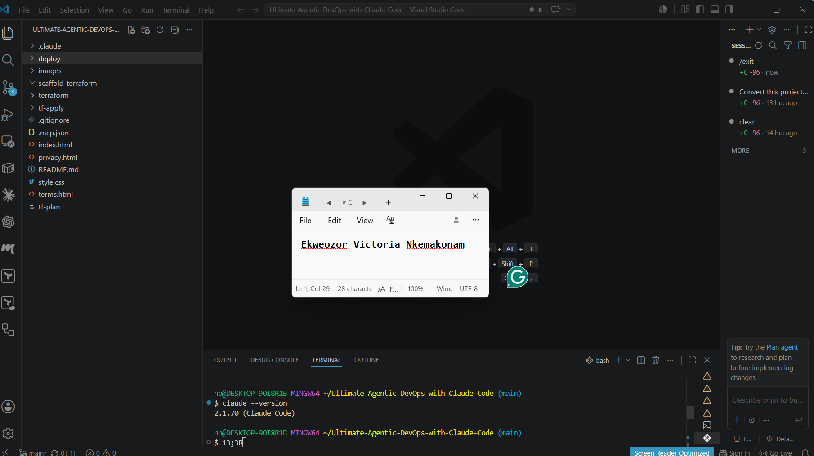
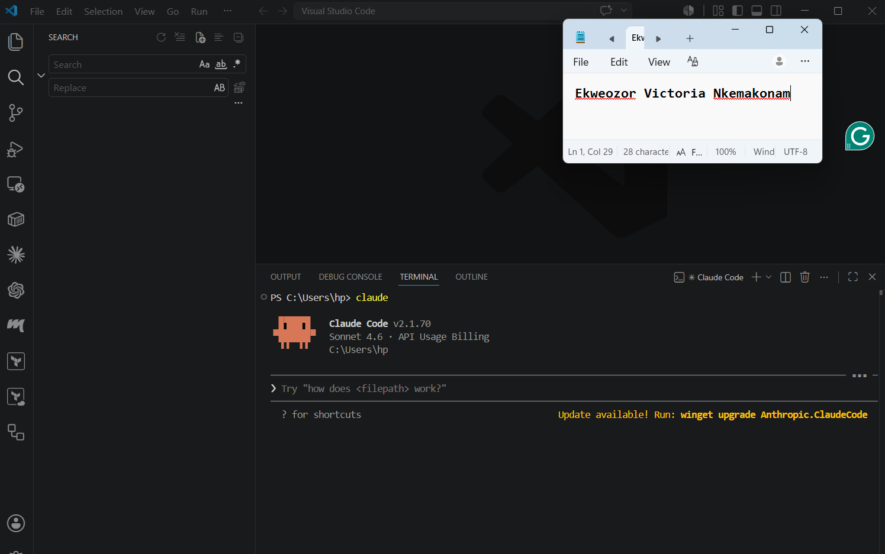
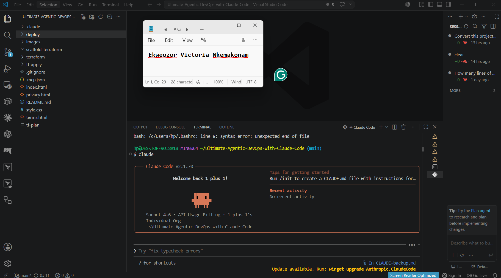
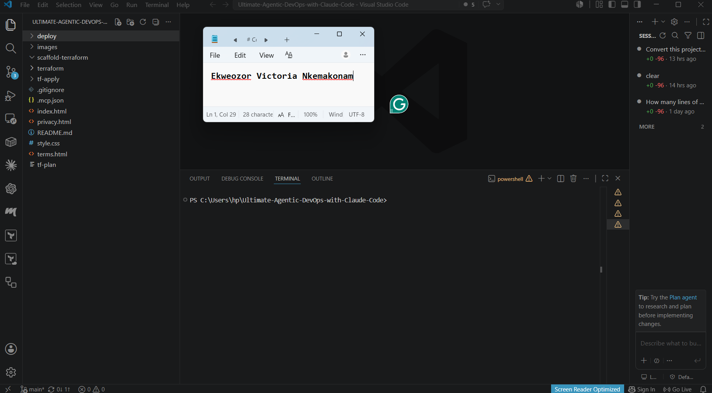
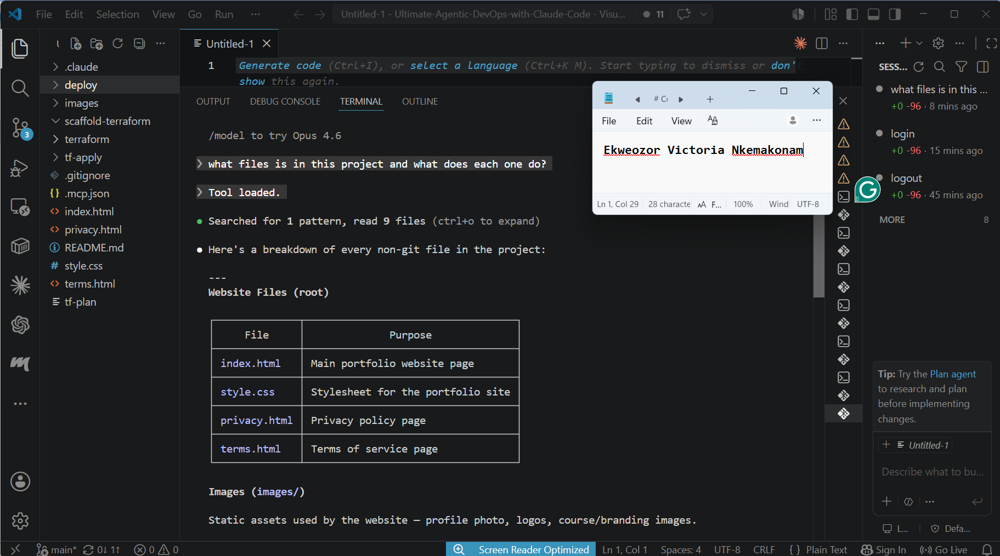
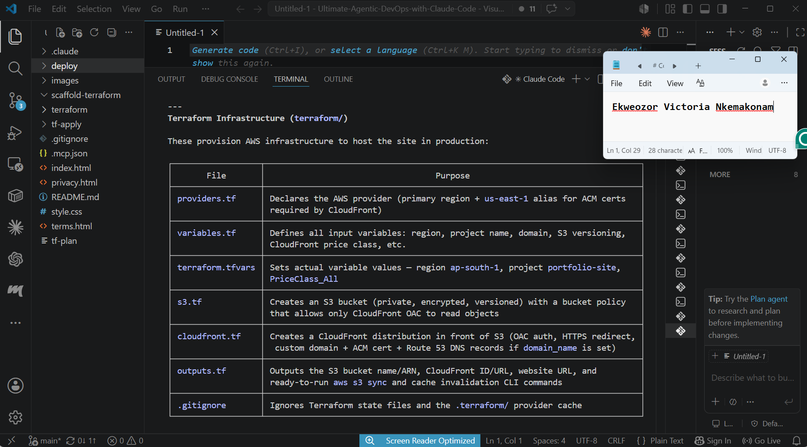
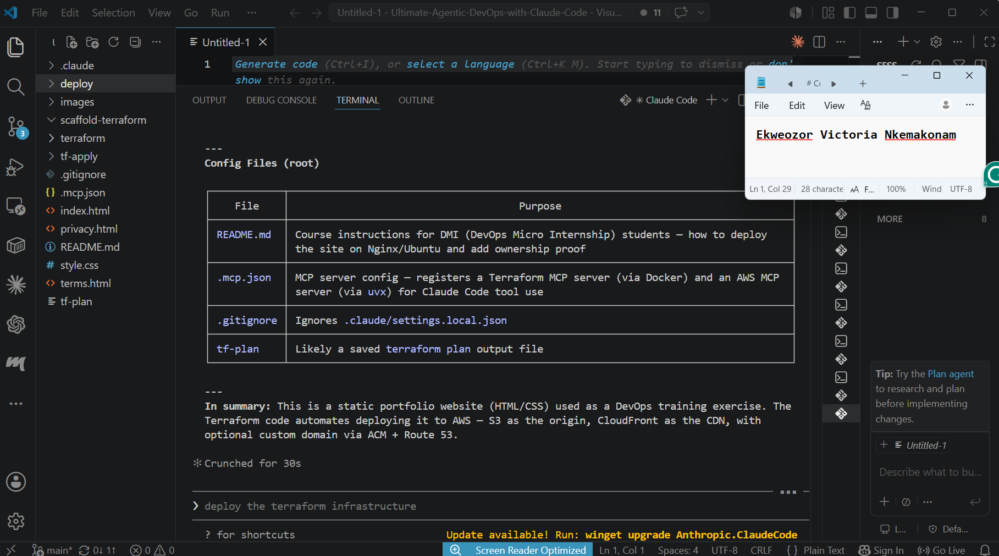
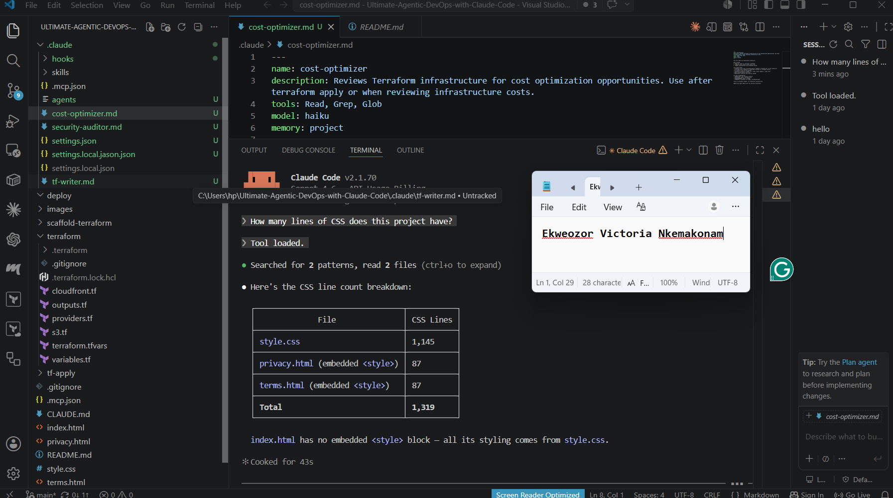

# Assignment 1 — Your First Agentic Session

Part of the DevOps Micro Internship (DMI) Cohort 3 with Agentic AI

---

## Purpose

In this assignment, you will set up your local development environment for Agentic AI using Claude Code. You will install and authenticate Claude Code CLI, fork and clone the starter repository, and observe how the Agentic Loop (Gather → Act → Verify) works in practice.

---

# Task 1 — Install Claude Code

## Goal

Install the Claude Code CLI globally and authenticate it using your Anthropic account.

### Evidence

#### Screenshot 1 — Terminal showing `claude --version` with the version number visible

---

#### Screenshot 2 — Claude Code authenticated and showing the terminal prompt (your name visible)

### Terminal showing claude --version 2

---

# Task 2 — Fork and Clone the  Repository

## Goal

Fork the provided GitHub repository, clone it to your local machine, and open it in VS Code.

### Evidence

#### Screenshot 3 — VS Code with the project open, file tree visible showing `index.html`, `style.css`, `images/`

# Task 3 — Observe the Agentic Loop

## Goal

Interact with Claude Code and observe how it performs the Agentic Loop (Gather → Act → Verify) while answering project-related questions.

### Evidence

#### Screenshot 4 — Claude's response to the first question, showing it read the files (tool calls visible)

---

#### Screenshot 5 — Claude's response to the second question, showing it ran a command and reported the line count

.

# Submission Instructions

- Add all required screenshots in your GitHub repository submission
- Full name must be visible in required screenshots
- Push your completed work to your forked repository
- Submit your GitHub repository URL below

---

## GitHub Repository URL
Paste your forked repository URL here:

https://github.com/nkemveekee-ike/devops-micro-internship-pravinmishra

---
# Completion Checklist

- [X] Claude Code CLI installed successfully
- [X] Claude Code authenticated successfully
- [X] Repository forked successfully
- [X] Repository cloned and opened in VS Code
- [X] All required screenshots added
- [X] GitHub repository URL provided

---

## 📌 About DMI & CloudAdvisory

DevOps Micro Internship (DMI) is a project-based DevOps program run by Pravin Mishra (The CloudAdvisory) focused on real-world execution, systems thinking, and career readiness.

It helps learners build strong DevOps foundations with hands-on experience.

---

## 📌 Resources

- 🌐 DMI Official Website: https://pravinmishra.com/dmi  
- 🎓 DevOps for Beginners (Udemy): https://www.udemy.com/course/devops-for-beginners-docker-k8s-cloud-cicd-4-projects/  
- 🎓 Agentic AI DevOps with Claude Code: https://www.udemy.com/course/ultimate-agentic-ai-devops-with-claude-code/  
- 🎓 DevOps with Claude Code: Terraform, EKS, ArgoCD & Helm: https://www.udemy.com/course/devops-with-claude-code-terraform-eks-argocd-helm/  
- ▶️ YouTube Playlist: https://www.youtube.com/playlist?list=PLFeSNDtI4Cho  
- 🔗 Pravin Mishra (LinkedIn): https://www.linkedin.com/in/pravin-mishra-aws-trainer/  
- 🏢 CloudAdvisory (LinkedIn): https://www.linkedin.com/company/thecloudadvisory/

---

*This submission is part of DevOps Micro Internship (DMI) Cohort 3 — Agentic AI Track.*