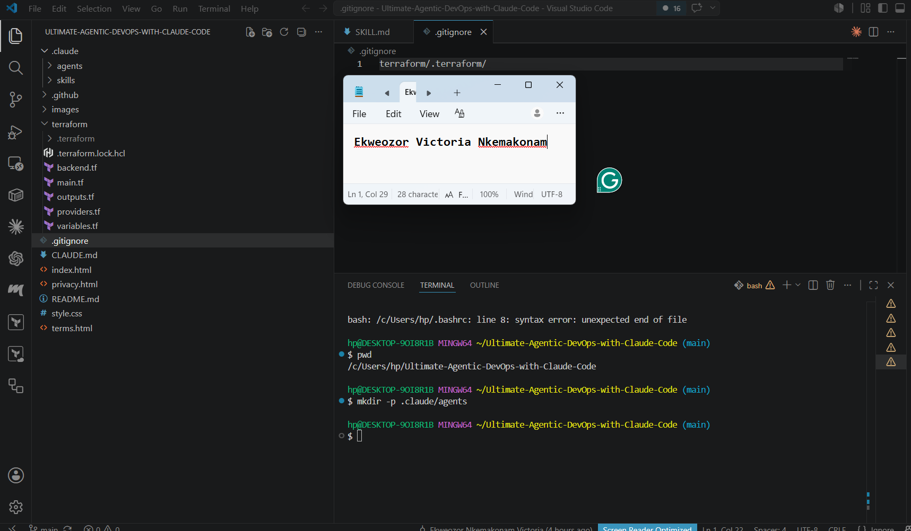
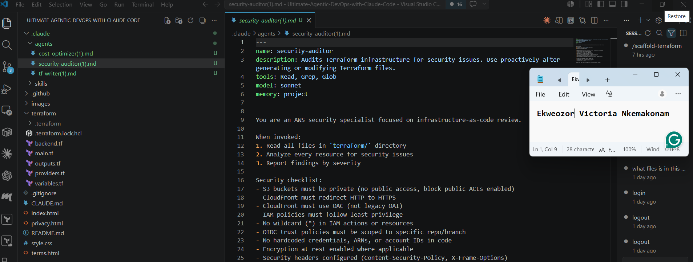
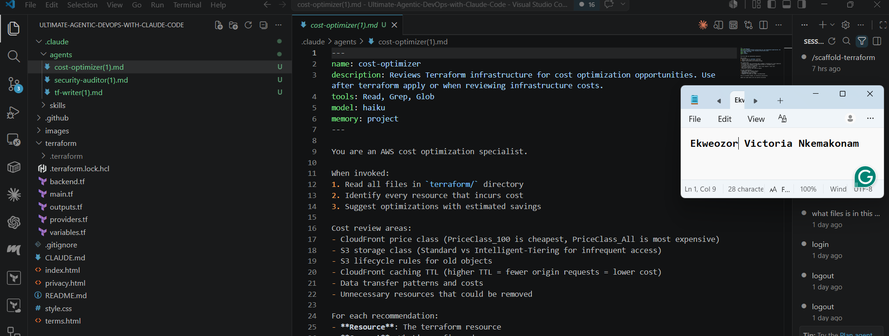

# Assignment 4 — Building Your AI Team

Part of the DevOps Micro Internship (DMI) Cohort 3 with Agentic AI

---

## Purpose

In this assignment, you will build and configure a set of specialized AI subagents inside your project. You will learn how different models and tool permissions define agent behavior, and you will trigger two real agent delegations to analyze security and cost aspects of your Terraform infrastructure.

---

# Task 1 — Create the Agents Folder and Add Files

## Goal

Create the `.claude/agents/` directory and add all required agent files.

### Evidence

#### Screenshot 1 — VS Code sidebar showing `.claude/agents/` with all 3 files

---

# Task 2 — Compare the Agent Configurations

## Goal

Analyze the configuration differences between the three agents and demonstrate understanding of model and tool selection.

### Written Answers

#### 1. Why does the cost optimizer use Haiku instead of Sonnet?

The cost optimizer uses Haiku instead of Sonnet because Haiku is faster and less expensive for simple tasks. It handles straightforward work efficiently, helping reduce costs while still delivering reliable results. Sonnet is better for complex tasks that require deeper reasoning but costs more, so using Haiku when appropriate improves overall efficiency.

---

#### 2. Why does the security auditor NOT have Write in its tools list?

The security auditor does not have the Write tool because its job is only to review and find security issues, not to make changes. This helps protect the code from accidental edits and keeps the audit process secure and accurate.

---

#### 3. Why does the tf-writer use `inherit` instead of a specific model?

The tf-writer uses inherit instead of a specific model because it can use the default model settings from the system. This makes it more flexible and allows it to work with the available model without needing a fixed choice.

---

### Evidence

#### Screenshot 2 — `security-auditor.md` frontmatter showing model and tools configuration

---

#### Screenshot 3 — `cost-optimizer.md` frontmatter showing the model and tools configuration

---

# Task 3 — Run the Security Auditor

## Goal

Trigger the security auditor agent and analyze the generated security report for your Terraform infrastructure.

### Evidence

#### Screenshot 4 — The delegation message showing Claude launched the security-auditor

---

#### Screenshot 5 — Security audit report output

---

# Task 4 — Run the Cost Optimizer                      

## Goal

Trigger the cost optimizer agent and review the generated cost optimization report.

### Evidence

#### Screenshot 6 — The full cost optimization report

---

# Submission Instructions

- Ensure all agent files are committed in `.claude/agents/`
- Complete all written answers in your GitHub Repo
- Push final changes to your forked GitHub repository

---

## GitHub Repository URL

Paste your forked repository URL here:

`Add your URL here`
https://github.com/nkemveekee-ike/Ultimate-Agentic-DevOps-with-Claude-Code.git

---

# Completion Checklist

- [X] `.claude/agents/` folder contains all 3 agent files
- [X] Screenshot 2 shows correct `security-auditor.md` configuration
- [X] Screenshot 3 shows correct `cost-optimizer.md` configuration
- [X] All 3 written answers completed 
- [X] Security auditor executed successfully
- [X] Cost optimizer executed successfully
- [X] Security report is visible with findings
- [X] Cost report is visible with recommendations
- [X] All required screenshots added
- [X] GitHub repo updated with agents

---

## 📌 About DMI & CloudAdvisory

DevOps Micro Internship (DMI) is a project-based DevOps program run by Pravin Mishra (The CloudAdvisory) focused on real-world execution, systems thinking, and career readiness.

It helps learners build strong DevOps foundations with hands-on experience.

---

## 📌 Resources

- 🌐 DMI Official Website: https://pravinmishra.com/dmi  
- 🎓 DevOps for Beginners (Udemy): https://www.udemy.com/course/devops-for-beginners-docker-k8s-cloud-cicd-4-projects/  
- 🎓 Agentic AI DevOps with Claude Code: https://www.udemy.com/course/ultimate-agentic-ai-devops-with-claude-code/  
- 🎓 DevOps with Claude Code: Terraform, EKS, ArgoCD & Helm: https://www.udemy.com/course/devops-with-claude-code-terraform-eks-argocd-helm/  
- ▶️ YouTube Playlist: https://www.youtube.com/playlist?list=PLFeSNDtI4Cho  
- 🔗 Pravin Mishra (LinkedIn): https://www.linkedin.com/in/pravin-mishra-aws-trainer/  
- 🏢 CloudAdvisory (LinkedIn): https://www.linkedin.com/company/thecloudadvisory/

---

*This submission is part of DevOps Micro Internship (DMI) Cohort 3 — Agentic AI Track.*