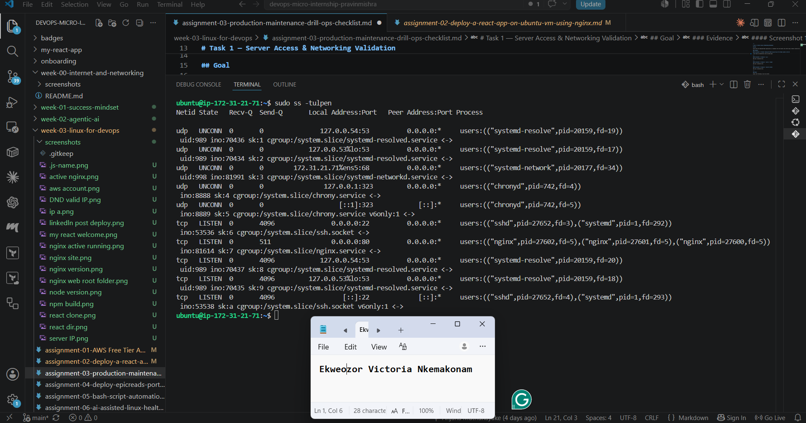
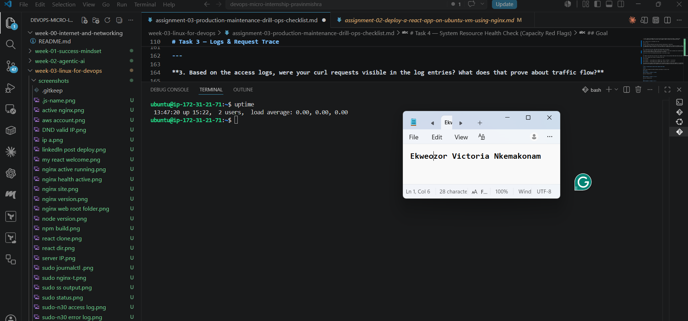
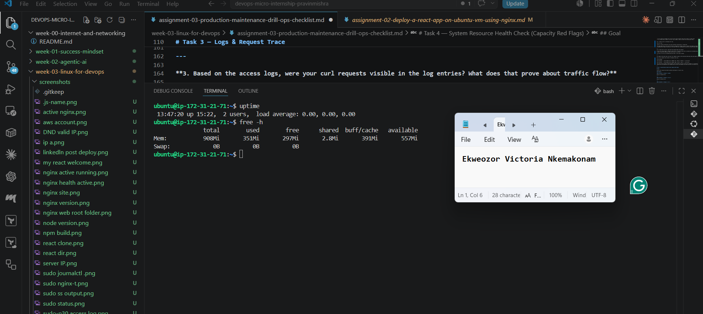
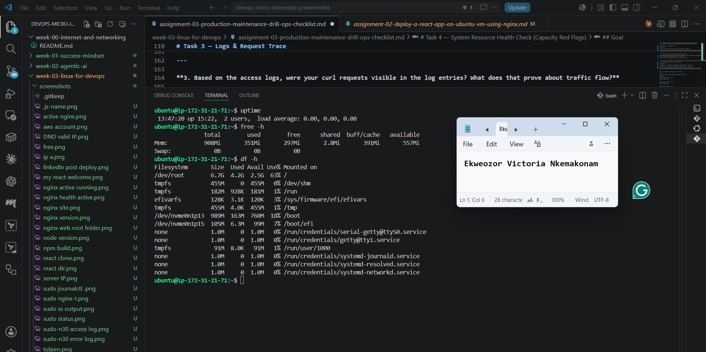
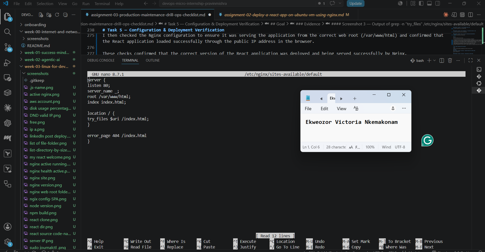
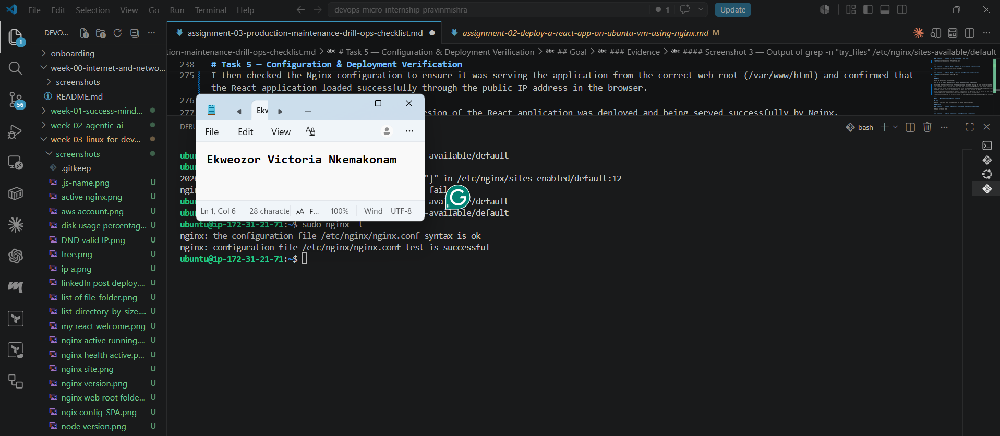

# Assignment 3 — Production Maintenance Drill (OPS Checklist)

Part of the DevOps Micro Internship (DMI) Cohort 3 with Agentic AI

---

## Purpose

In this assignment, you will treat your already deployed React application (on Ubuntu VM with Nginx) as a live production system. You will perform structured operational checks covering network validation, service health, log analysis, resource monitoring, configuration verification, and incident simulation with recovery — mirroring real on-call DevOps responsibilities.

---

# Task 1 — Server Access & Networking Validation

## Goal

Verify that the deployed React application is reachable from the browser and confirm basic network connectivity of the Ubuntu VM.

### Evidence

#### Screenshot 1 — Browser showing the React app with your Full Name visible on the UI

---

#### Screenshot 2 — Output of `ip a`

---

#### Screenshot 3 — Output of `sudo ss -tulpen`

---

#### Screenshot 4 — Output of `sudo ufw status`

---

### Notes

Answer the following in your own words:

**1. What proves Nginx is listening on 0.0.0.0:80?**

The output of `sudo ss -tulpen` shows that Nginx is listening on `0.0.0.0:80`. The `LISTEN` state confirms that the service is actively waiting for incoming connections, while `0.0.0.0:80` means it is accepting HTTP requests on port 80 from all available network interfaces. The presence of `nginx` in the output confirms that Nginx is the service using that port.

---

**2. What proves SSH is active on port 22?**

The output of `sudo ss -tulpen` proves that SSH is active on port 22. It shows that the SSH service is in the `LISTEN` state, which means it is running and ready to accept connections. It also shows `0.0.0.0:22`, confirming that SSH is listening on port 22 on the server. The `sshd` process in the output confirms that SSH is the service using this port.
---

**3. Did you find any unexpected open ports? Explain briefly.**

No, I did not find any unexpected open ports. The open ports shown are associated with the services running on the server, such as SSH on port 22 and Nginx on port 80. The remaining ports are used by system services for networking, name resolution, and time synchronization. Based on the output, all open ports appear to be expected and appropriate for the current server configuration.

---

# Task 2 — Service Health & Systemd Validation (Nginx)

## Goal

Verify that Nginx is properly installed, running, enabled at boot, and safely configured.

### Evidence

#### Screenshot 1 — Output of `systemctl status nginx --no-pager`

---

#### Screenshot 2 — Output of `sudo nginx -t`

---

#### Screenshot 3 — Output of `sudo ss -lptn '( sport = :80 )'`

---

### Notes

Answer the following in your own words:

**1. What happens if Nginx fails to restart in production?**

If Nginx fails to restart in production, users will not be able to access the application through the web browser. The website may display an error message or become unavailable because Nginx is responsible for serving the application's content and handling incoming requests. This can lead to downtime until the issue is identified and the service is restored.

---

**2. What's your basic rollback plan?**

My basic rollback plan is to first identify the cause of the problem by checking the Nginx service status (`sudo systemctl status nginx`) and reviewing the logs (`sudo journalctl -u nginx` or `sudo tail -20 /var/log/nginx/error.log`). If a recent change caused the issue, I would restore the last known working version of the application or the Nginx configuration files from a backup. After restoring the files, I would restart Nginx using (`sudo systemctl restart nginx`) and confirm that the application is accessible through the public IP address. Finally, I would verify that all services are running normally before considering the issue resolved.

---

# Task 3 — Logs & Request Trace

## Goal

Verify real traffic flow and analyze logs to understand system behavior and errors.

### Evidence

#### Screenshot 1 — Output of `sudo tail -n 30 /var/log/nginx/access.log`

---

#### Screenshot 2 — Output of `sudo tail -n 30 /var/log/nginx/error.log`

---

#### Screenshot 3 — Output of `sudo journalctl -u nginx --no-pager -n 50`

---

### Notes

Answer the following in your own words:

**1. Were there any errors in the logs?**

- If yes, mention 1–2 example error lines from the logs and explain what each one means in simple terms.
- If no, explain what it means if the error log is empty or shows no recent errors during your check.

Yes, I found an error in the Nginx error log.

The error line:

rewrite or internal redirection cycle while internally redirecting to "/index.html"

This means Nginx had an issue with the redirect configuration and kept trying to redirect the request to index.html repeatedly instead of completing the request successfully. This shows there was a configuration issue while serving the React application.

---

**2. If there were no errors, what does that indicate about the system?**

If the error log was empty or showed no recent errors, it would only mean that no problems were recorded during the period I checked. It does not mean the system will never have issues in the future.

In my case, an error was recorded during the check, so this does not apply.

---

**3. Based on the access logs, were your curl requests visible in the log entries? What does that prove about traffic flow?**

Yes, my curl requests were visible in the Nginx access log.

The log showed:

184.73.100.194 - - [15/Jul/2026:13:21:12 +0000] "GET / HTTP/1.1" 200 644 "-" "curl/8.18.0"

184.73.100.194 - - [15/Jul/2026:13:22:14 +0000] "HEAD / HTTP/1.1" 200 0 "-" "curl/8.18.0"

This proves that my request reached the Nginx server and Nginx was able to process and respond to it successfully. The 200 status code confirms that the application was reachable and the traffic flow between the client and server was working correctly.

---

# Task 4 — System Resource Health Check (Capacity Red Flags)

## Goal

Assess server capacity and detect potential performance or failure risks.

### Evidence

#### Screenshot 1 — Output of `uptime`

---

#### Screenshot 2 — Output of `free -h`

---

#### Screenshot 3 — Output of `df -h`

---

#### Screenshot 4 — Output of `sudo du -sh /var/* | sort -h`

---

### Notes

Answer the following in your own words:

**1. Which resource looks most critical right now? (CPU/load, memory, or disk) Explain why.**

Based on my system checks, the disk usage is the resource that needs more attention, although it is not critical at the moment.

From the df -h output, the main disk (/dev/root) is using 63% of the available space, with 2.5GB remaining. The CPU load is very low (0.00, 0.00, 0.00), and the memory check shows that 557Mi is still available, so there is no immediate issue with CPU or memory.

Disk usage is important to monitor because when storage gets close to full capacity, it can affect applications, logs, and overall server stability.

---

**2. What happens if disk becomes 100% full in a production server?**

If the disk becomes 100% full, the server can start experiencing problems because there will be no space available for new data.

Some possible issues are:

**Logs may stop writing because there is no storage space left.**
**Applications may fail if they cannot create or save required files.**
**The server may become unstable or unresponsive because important system processes need disk space to operate.**

This is why disk usage should be monitored regularly in a production environment.

---

# Task 5 — Configuration & Deployment Verification

## Goal

Ensure the correct React build is deployed and Nginx is serving it properly.

### Evidence

#### Screenshot 1 — Output of `ls -lah /var/www/html | head -n 20`

---

#### Screenshot 2 — Output of `grep -R "Deployed by" -n /var/www/html 2>/dev/null | head`

---

#### Screenshot 3 — Output of `grep -n "try_files" /etc/nginx/sites-available/default`

---

### Notes

Answer the following in your own words:

**1. How do you confirm that the correct version of the application is deployed?**

I confirmed that the correct version of the application was deployed by checking the files inside /var/www/html using the ls -lah command. This allowed me to verify that the React build files were present, including important files such as index.html and the static folder.

I also verified that my custom change was included in the deployed application by searching the deployed files for the "Deployed by Ekweozor Nkemakonam Victoria" line. This confirmed that the latest React build contained my update.

I then checked the Nginx configuration to ensure it was serving the application from the correct web root (/var/www/html) and confirmed that the React application loaded successfully through the public IP address in the browser.

These checks confirmed that the correct version of the React application was deployed and being served successfully by Nginx.

---

# Task 6 — Nginx Configuration Failure Simulation

## Goal

Simulate a real-world Nginx misconfiguration and recover the service safely.

### Evidence

#### Screenshot 1 — Output of `sudo nginx -t` showing the syntax error (broken config)

---

#### Screenshot 2 — Output of `sudo nginx -t` showing syntax ok (fixed config)

---

#### Screenshot 3 — Output of `curl -I http://<public-ip>` confirming recovery (200 OK)

---

### Notes

Answer the following in your own words:

**1. What caused the configuration failure?**

The configuration failure was caused by introducing a syntax error in the Nginx configuration file. A required semicolon (;) was removed from the configuration, which made the Nginx configuration invalid. When I ran sudo nginx -t, Nginx detected the error and failed the configuration test.

---

**2. How did you fix the issue?**

I fixed the issue by opening the Nginx configuration file again using:

sudo nano /etc/nginx/sites-available/default

I restored the missing semicolon and corrected the configuration. After making the correction, I validated the configuration using:

sudo nginx -t

The test was successful, so I restarted Nginx using:

sudo systemctl restart nginx

Finally, I confirmed that the application recovered by checking the response with:

curl -I http://184.73.100.194

which returned HTTP/1.1 200 OK.

---

**3. How can you avoid this kind of issue in real production systems?**

In a real production environment, this type of issue can be avoided by always validating configuration changes before restarting services. Using commands like nginx -t helps detect errors before they affect users. It is also important to make changes carefully, keep backups or version control of configuration files, and test changes in a staging environment before applying them to production.

---

# Task 7 — Web Application Failure Simulation

## Goal

Simulate missing deployment content and recover the application safely.

### Evidence

#### Screenshot 1 — Output of `curl -I http://<public-ip>` showing failure (non-200 response)

---

#### Screenshot 2 — Output of `curl -I http://<public-ip>` confirming recovery (200 OK)

---

### Notes

Answer the following in your own words:

**1. What caused the application to break in this scenario?**

The application broke because the web content directory was missing during the simulation. Since Nginx could not find the deployed React application files in /var/www/html, it was unable to serve the application and returned a 500 Internal Server Error.

---

**2. How did you fix the issue and restore the application?**

I fixed the issue by restoring the application files from the backup to the /var/www/html directory and restarting the Nginx service. After that, I used curl -I http://184.73.100.194 and received HTTP/1.1 200 OK, which confirmed that the application had been successfully restored and was working normally again.

---

**3. What steps would you take to prevent this kind of issue in real production systems?**

To prevent this kind of issue in a real production environment, I would always keep backups of deployed applications before making changes. I would also verify deployment paths before deleting or moving files, test changes in a staging environment when possible, and monitor the server after deployments. Having a rollback plan and regular backups helps reduce downtime and makes recovery much faster if problems occur.

---

# Task 8 — Security & Reliability Review

## Goal

Review and reflect on the security and reliability practices applied during this assignment.

### Security & Reliability Notes

Answer the following in your own words:

**1. Why is SSH key-based authentication more secure than sharing passwords?**

SSH key-based authentication is more secure than sharing passwords because SSH keys are much harder to guess or crack. Unlike passwords, private keys are not sent over the network during authentication, which reduces the risk of unauthorized access. It also makes it easier to manage secure access to production servers.

---

**2. Why should only required ports be open on a production server?**

Only the required ports should be open on a production server because every open port increases the potential attack surface of the system. Keeping only the necessary ports open, such as port 22 for SSH and port 80 for web traffic in this assignment, helps improve the overall security of the server.

---

**3. Why is it important for Nginx to be enabled on boot?**

It is important for Nginx to be enabled on boot so that the web application becomes available automatically whenever the server restarts. This improves reliability by reducing downtime and ensures that users can access the application without requiring manual intervention after every reboot.

---

**4. What are the risks of sharing secrets, keys, or credentials publicly?**
Sharing secrets, keys, or credentials publicly can lead to unauthorized access, data loss, and security breaches. If someone gains access to private keys or cloud credentials, they may be able to control cloud resources, modify applications, or incur unexpected costs. Sensitive information should always be kept private and stored securely.

---

**5. Why should cloud resources be stopped or terminated when they are no longer needed?**

Cloud resources should be stopped or terminated when they are no longer needed to avoid unnecessary charges and reduce security risks. Unused resources can still become targets for attacks if they remain accessible. Properly managing cloud resources helps control costs and maintain a secure environment.

---

# LinkedIn Post (Required)

## Evidence

#### LinkedIn Post URL

https://www.linkedin.com/posts/ekweozor_devops-aws-linux-share-7483201910586523648-lLMS/?utm_source=share&utm_medium=member_desktop&rcm=ACoAAEFzwtYB-RXnYG13TMOIwtIDL3APbwSz4XI

`Add your URL here`

---

#### Screenshot — Published LinkedIn post

---

# Submission Instructions

- Add all required screenshots in your submission
- Full name must be visible in required screenshots
- Do not expose sensitive information (keys, passwords, account IDs)

---

# Completion Checklist

- [X] Task 1: Screenshots (browser, ip a, ss -tulpen, ufw status) + Notes answered
- [X] Task 2: Screenshots (nginx status, nginx -t, ss port 80) + Notes answered
- [X] Task 3: Screenshots (access log, error log, journalctl) + Notes answered
- [X] Task 4: Screenshots (uptime, free -h, df -h, du -sh) + Notes answered
- [X] Task 5: Screenshots (ls html, grep deployed by, grep try_files) + Notes answered
- [X] Task 6: Screenshots (nginx -t fail, nginx -t pass, curl recovery) + Notes answered
- [X] Task 7: Screenshots (curl failure, curl recovery) + Notes answered
- [X] Task 8: Security & Reliability Notes answered
- [X] LinkedIn post published and URL submitted
- [X] Full Name visible in all required screenshots
- [X] No sensitive data exposed

---

## 📌 About DMI & CloudAdvisory

DevOps Micro Internship (DMI) is a project-based DevOps program run by Pravin Mishra (The CloudAdvisory) focused on real-world execution, systems thinking, and career readiness.

It helps learners build strong DevOps foundations with hands-on experience.

---

## 📌 Resources

- 🌐 DMI Official Website: https://pravinmishra.com/dmi  
- 🎓 DevOps for Beginners (Udemy): https://www.udemy.com/course/devops-for-beginners-docker-k8s-cloud-cicd-4-projects/  
- 🎓 Agentic AI DevOps with Claude Code: https://www.udemy.com/course/ultimate-agentic-ai-devops-with-claude-code/  
- 🎓 DevOps with Claude Code: Terraform, EKS, ArgoCD & Helm: https://www.udemy.com/course/devops-with-claude-code-terraform-eks-argocd-helm/  
- ▶️ YouTube Playlist: https://www.youtube.com/playlist?list=PLFeSNDtI4Cho  
- 🔗 Pravin Mishra (LinkedIn): https://www.linkedin.com/in/pravin-mishra-aws-trainer/  
- 🏢 CloudAdvisory (LinkedIn): https://www.linkedin.com/company/thecloudadvisory/

---

*This submission is part of DevOps Micro Internship (DMI) Cohort 3 — Agentic AI Track.*