# Assignment 5 — Bash Script Automation Drill (OPS Checklist)

Part of the DevOps Micro Internship (DMI) Cohort 3 with Agentic AI

---

## Purpose

In this assignment, you will practice Bash scripting by building a series of small automation scripts covering environment setup, variables, arrays, loops, file conditionals, if-else logic, and functions. These scripts form the foundation of real-world Linux automation used in DevOps, cloud, and production support environments.

---

# Task 1 — Bash Environment & Workspace Setup

## Goal

Verify that Bash is available on your system and create a clean workspace for this assignment.

### Evidence

#### Screenshot 1 — Output of `echo $SHELL` and `bash --version`

---

#### Screenshot 2 — Output of `pwd` and `ls -lah` showing the scripts directory

---

### Notes

Answer the following in your own words:

**1. What is Bash?**

Bash (Bourne Again Shell) is a command-line interpreter used in Linux and Unix systems. It allows users to interact with the operating system by running commands and creating scripts to automate tasks.

---

**2. What is the difference between shell and Bash?**

A shell is a general program that provides an interface between the user and the operating system. Bash is one specific type of shell that provides additional features such as scripting, variables, loops, and conditionals.

---

**3. Why is it important to confirm the Bash version before writing scripts?**

Confirming the Bash version helps ensure that the script will run correctly and that the features being used are supported by the installed Bash environment.

---

# Task 2 — Your First Bash Script

## Goal

Create your first Bash script, make it executable, and run it from the terminal.

### Evidence

#### Screenshot 1 — Content of `first-script.sh`

---

#### Screenshot 2 — Output of `./first-script.sh`

---

#### Screenshot 3 — Output of `ls -l first-script.sh` showing executable permission

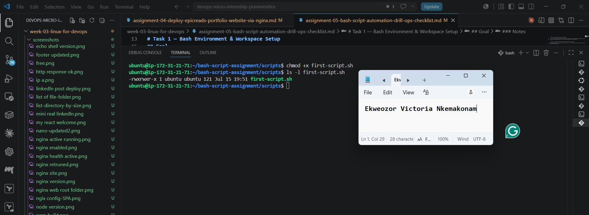

---

### Notes

Answer the following in your own words:

**1. What is the purpose of `#!/bin/bash`?**

#!/bin/bash is called a shebang line. It tells the Linux system that the script should be executed using the Bash shell interpreter. It ensures the commands inside the script are run with Bash.

---

**2. Why do we use `chmod +x` before running a script?**

chmod +x gives the script execute permission. Without this permission, Linux will not allow the script file to run directly using ./script-name.sh.

---

**3. What is the difference between running a script using `./script.sh` and `bash script.sh`?**

./script.sh runs the script directly and requires the file to have execute permission. It also uses the interpreter specified in the shebang line.

bash script.sh runs the script by explicitly calling the Bash interpreter and does not require execute permission on the file.

---

# Task 3 — Variables: User Information Script

## Goal

Use variables to store and display user-related information.

### Evidence

#### Screenshot 1 — Content of `user-info.sh`

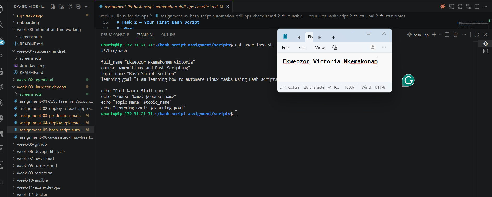

---

#### Screenshot 2 — Output of `./user-info.sh`

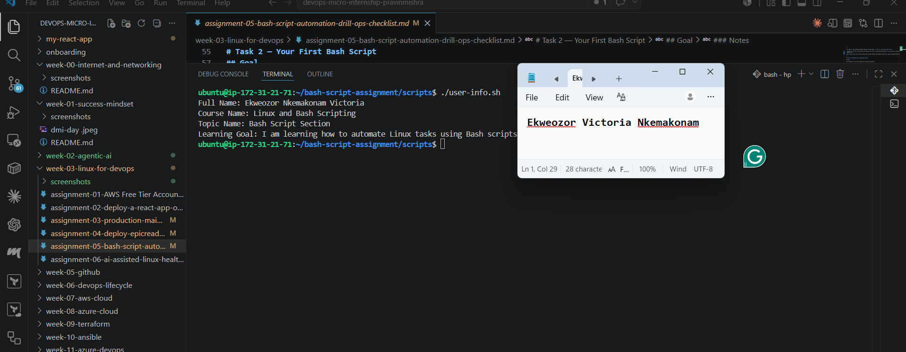

---

### Notes

Answer the following in your own words:

**1. What is a variable in Bash?**

A variable in Bash is a named container used to store information such as text, numbers, or command results. Variables allow values to be saved and reused throughout a script, making automation easier and more flexible.

---

**2. Why should we avoid spaces around the `=` sign when creating variables?**

Spaces should be avoided around the = sign because Bash treats spaces as separators between commands and arguments. Writing spaces can cause errors because Bash will not recognize it as a variable assignment. 
Correct example:

full_name="Ekweozor Nkemakonam Victoria"

Incorrect example:

full_name = "Ekweozor Nkemakonam Victoria"

---

**3. How do you access the value stored inside a Bash variable?**

The value stored inside a Bash variable is accessed by placing a $ sign before the variable name.

Example:

echo "$full_name"

This displays the value stored in the full_name variable.

---

# Task 4 — Arrays & Loops: Tools Checklist Script

## Goal

Use arrays and loops to print a checklist of tools used in Bash scripting.

### Evidence

#### Screenshot 1 — Content of `tools-checklist.sh`

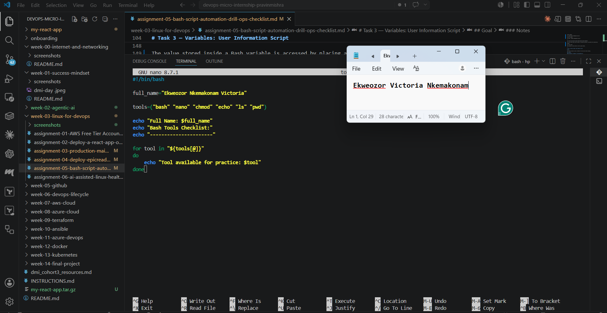

---

#### Screenshot 2 — Output of `./tools-checklist.sh`

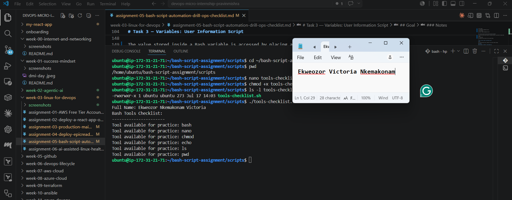

---

### Notes

Answer the following in your own words:

**1. What is an array in Bash?**

An array in Bash is a variable that can store multiple values under a single name. Instead of creating separate variables for each item, an array allows related items to be stored and accessed together.

---

**2. Why are arrays useful in scripts?**

Arrays are useful because they help organize and manage multiple values efficiently. They make scripts easier to read, reduce repeated code, and allow tasks to be performed on multiple items using loops.

---

**3. What does `"${tools[@]}"` mean?**

${tools[@]} represents all the elements stored inside the tools array. It allows the script to access and process each item in the array individually while keeping the values separated correctly.

---

**4. What is the purpose of the `for` loop in this script?**

The for loop is used to repeat an action for each item in the array. In this script, it goes through each tool stored in the tools array and prints the name of each tool one by one.

---

# Task 5 — Loops: Number Counter Script

## Goal

Use loops to repeat a task multiple times.

### Evidence

#### Screenshot 1 — Content of `counter.sh`

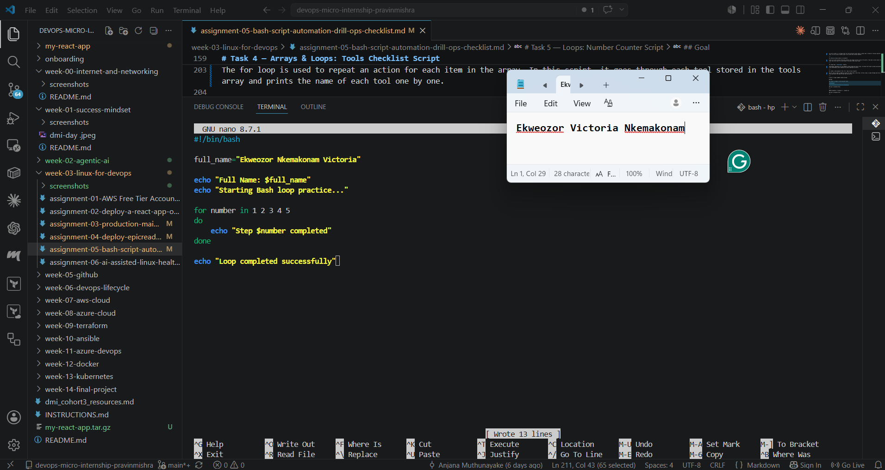

---

#### Screenshot 2 — Output of `./counter.sh`

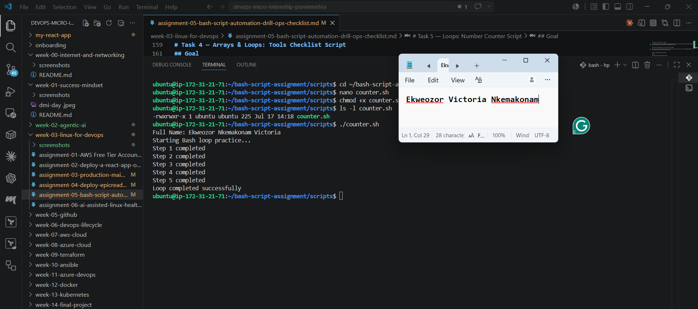

---

### Notes

Answer the following in your own words:

**1. What is a loop?**

A loop is a programming structure that allows a set of instructions to be repeated multiple times until a specific condition is met or until all items in a list have been processed.

---

**2. Why do we use loops in Bash scripting?**

Loops are used in Bash scripting to automate repeated tasks, reduce manual work, and make scripts more efficient. They allow commands to run multiple times without writing the same code repeatedly.

---

**3. How many times did the loop run in your script?**

The loop ran 5 times because the script processed the numbers 1, 2, 3, 4, and 5. Each number produced one completed step message.

---

**4. What would you change if you wanted the loop to run 10 times?**

To make the loop run 10 times, I would add more numbers to the loop sequence or use a range that goes from 1 to 10.

Example:

for number in 1 2 3 4 5 6 7 8 9 10
do
    echo "Step $number completed"
done

---

# Task 6 — Files & Conditionals: File Validation Script

## Goal

Use file checks and conditionals to verify whether files and directories exist.

### Evidence

#### Screenshot 1 — Output of `ls -lah ../test-folder`

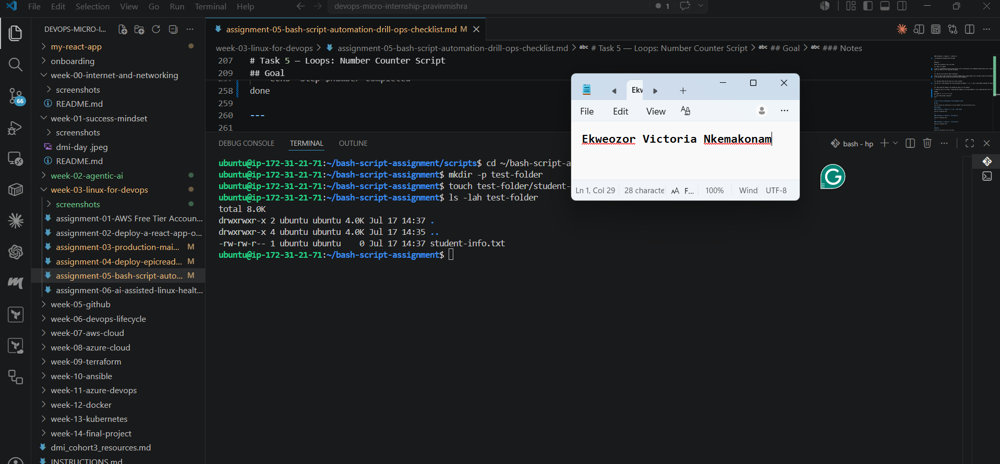

---

#### Screenshot 2 — Content of `file-check.sh`

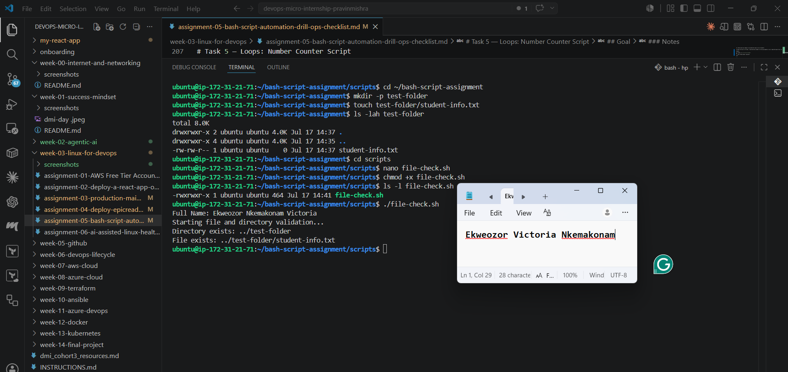

---

#### Screenshot 3 — Output of `./file-check.sh`

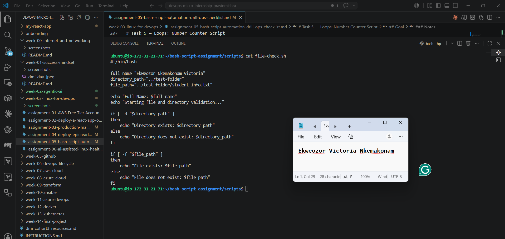

---

### Notes

Answer the following in your own words:

**1. What does `-d` check in Bash?**

The -d test checks whether a specified path exists and is a directory. In this script, it is used to confirm that the test-folder directory exists before continuing.

---

**2. What does `-f` check in Bash?**

The -f test checks whether a specified path exists and is a regular file. In this script, it verifies that the student-info.txt file exists inside the test folder.

---

**3. Why should file and directory paths be stored in variables?**

Storing file and directory paths in variables makes scripts easier to read, maintain, and update. If the location changes, we only need to update the variable instead of changing the path in multiple places throughout the script.

---

**4. What happens if the file does not exist?**

If the file does not exist, the if condition using -f will return false, and the script will execute the else section. It will display a message that the file does not exist.

---

# Task 7 — Conditionals: Pass or Retry Script

## Goal

Use if-else conditionals to make decisions based on a variable value.

### Evidence

#### Screenshot 1 — Content of `score-check.sh` with `score=85`

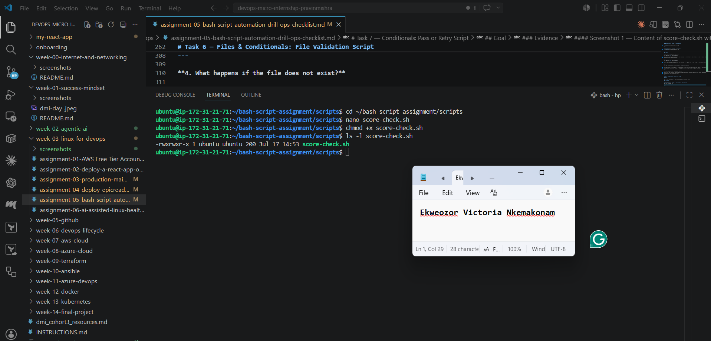

---

#### Screenshot 2 — Output showing `Result: Pass`

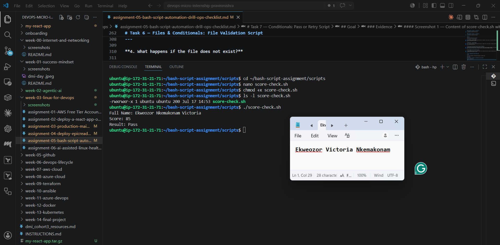

---

#### Screenshot 3 — Content of `score-check.sh` with `score=55`

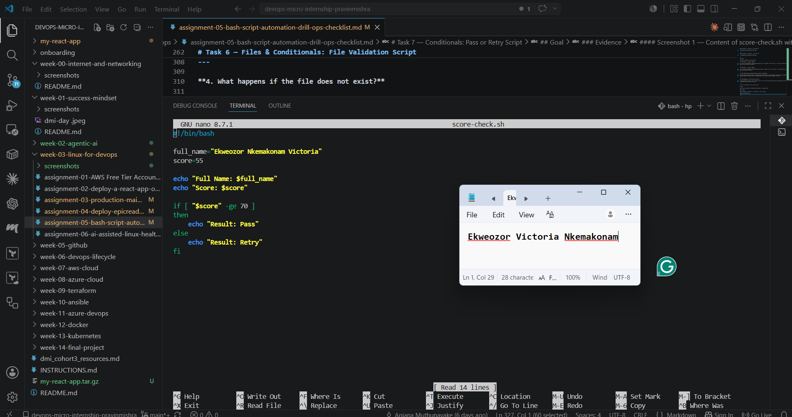

---

#### Screenshot 4 — Output showing `Result: Retry`

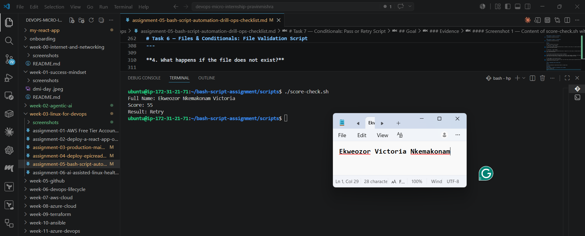

---

### Notes

Answer the following in your own words:

**1. What is the purpose of if-else in Bash?**

The if-else statement is used to make decisions in Bash scripts based on whether a condition is true or false. It allows a script to perform different actions depending on the result of the condition being tested.

---

**2. What does `-ge` mean?**

The -ge operator means "greater than or equal to." It is used to compare numerical values. In this script, it checks whether the score is 70 or higher to determine if the result should be Pass.

---

**3. Why should conditions be tested with different values?**

Testing conditions with different values helps verify that both outcomes of the script work correctly. In this task, using 85 confirms that the script displays Pass, while using 55 confirms that it displays Retry.

---

**4. How can conditionals help in automation scripts?**

Conditionals make automation scripts more flexible by allowing them to respond to different situations automatically. They can be used to validate files, check system status, handle errors, and make decisions without requiring manual intervention.

---

# Task 8 — Functions: Final Bash Automation Script

## Goal

Create a final Bash script using functions to organize reusable code.

### Evidence

#### Screenshot 1 — Content of `final-automation.sh`

---

#### Screenshot 2 — Output of `./final-automation.sh`

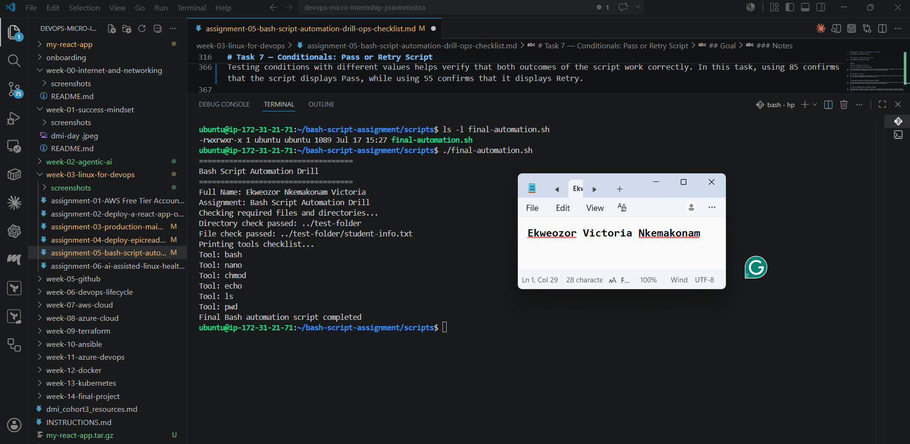

---

#### Screenshot 3 — Output of `ls -lah` showing all created scripts

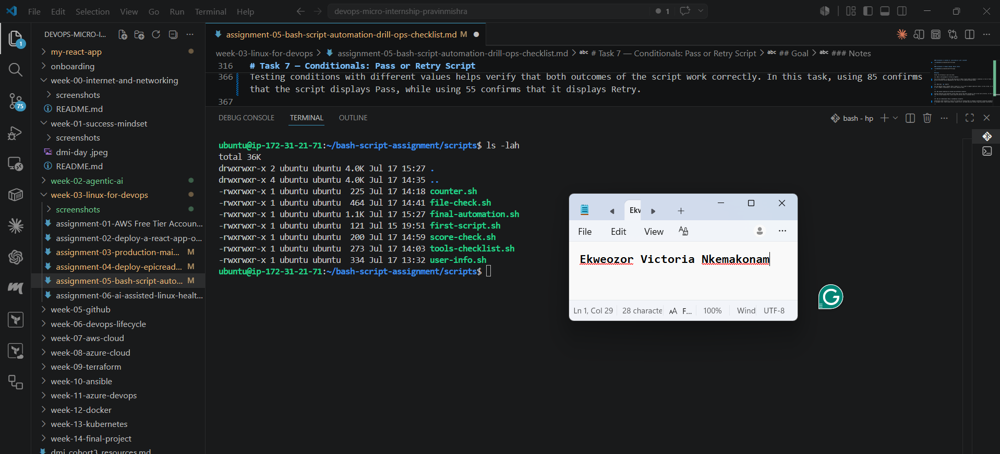

---

### Notes

Answer the following in your own words:

**1. What is a function in Bash?**

A function in Bash is a block of code that performs a specific task. It allows me to group related commands together and run them whenever needed without rewriting the same code.

---

**2. Why are functions useful in scripts?**

Functions make scripts easier to read, organize, and maintain. They also reduce repetition because I can reuse the same function whenever I need it.

---

**3. Which functions did you create in this script?**

I created four functions in this script:

print_header()
print_user_details()
check_files()
print_tools()

Each function performs a different task to keep the script organized.

---

**4. How does this final script combine variables, arrays, loops, conditionals, files, and functions?**

This script combines several Bash concepts together. Variables are used to store information such as my name and assignment details. An array stores the list of tools, and a for loop prints each tool one by one. Conditionals are used to check whether the required file and directory exist. Functions organize the different parts of the script, making it easier to understand and reuse. Together, these concepts demonstrate how Bash can be used to automate simple Linux tasks.

---

# LinkedIn Post (Required)

## Evidence

#### LinkedIn Post URL

https://www.linkedin.com/posts/ekweozor_devops-linux-bashscripting-ugcPost-7483916007321997312-XvEw/?utm_source=share&utm_medium=member_desktop&rcm=ACoAAEFzwtYB-RXnYG13TMOIwtIDL3APbwSz4XI

`__________________________`

---

#### Screenshot — Published LinkedIn post

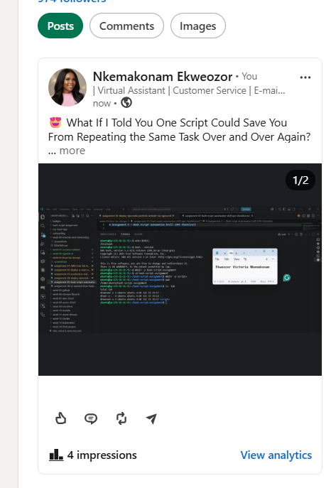

---

# Submission Instructions

- Add all required screenshots in your submission
- Full name must be visible in required screenshots
- All script files must be created and run successfully
- Required notes must be answered clearly for every task
- Do not expose sensitive information (keys, passwords, credentials)

---

# Completion Checklist

- [X] Task 1: Environment setup verified, workspace created (Screenshots 1–2, Notes answered)
- [X] Task 2: First script created, executed, permissions verified (Screenshots 1–3, Notes answered)
- [X] Task 3: Variables script created and run (Screenshots 1–2, Notes answered)
- [X] Task 4: Arrays and loops script created and run (Screenshots 1–2, Notes answered)
- [X] Task 5: Counter loop script created and run (Screenshots 1–2, Notes answered)
- [X] Task 6: File validation script created and run (Screenshots 1–3, Notes answered)
- [X] Task 7: Pass/Retry conditional script tested with both values (Screenshots 1–4, Notes answered)
- [X] Task 8: Final automation script created and run (Screenshots 1–3, Notes answered)
- [X] All scripts run without errors
- [X] Full Name visible in all required screenshots
- [X] LinkedIn post published and URL submitted
- [X] No sensitive data exposed

---

## 📌 About DMI & CloudAdvisory

DevOps Micro Internship (DMI) is a project-based DevOps program run by Pravin Mishra (The CloudAdvisory) focused on real-world execution, systems thinking, and career readiness.

It helps learners build strong DevOps foundations with hands-on experience.

---

## 📌 Resources

- 🌐 DMI Official Website: https://pravinmishra.com/dmi  
- 🎓 DevOps for Beginners (Udemy): https://www.udemy.com/course/devops-for-beginners-docker-k8s-cloud-cicd-4-projects/  
- 🎓 Agentic AI DevOps with Claude Code: https://www.udemy.com/course/ultimate-agentic-ai-devops-with-claude-code/  
- 🎓 DevOps with Claude Code: Terraform, EKS, ArgoCD & Helm: https://www.udemy.com/course/devops-with-claude-code-terraform-eks-argocd-helm/  
- ▶️ YouTube Playlist: https://www.youtube.com/playlist?list=PLFeSNDtI4Cho  
- 🔗 Pravin Mishra (LinkedIn): https://www.linkedin.com/in/pravin-mishra-aws-trainer/  
- 🏢 CloudAdvisory (LinkedIn): https://www.linkedin.com/company/thecloudadvisory/

---

*This submission is part of DevOps Micro Internship (DMI) Cohort 3 — Agentic AI Track.*