# Assignment 6 — Build an AI-Assisted Linux Health Check (AI-Assisted Linux Incident Triage)

Part of the DevOps Micro Internship (DMI) Cohort 3 with Agentic AI

---

## Purpose

In this assignment, you will build a read-only Bash triage script that checks the health of your Ubuntu server and Nginx application, connect it to Claude Code as a reusable `/linux-triage` skill, simulate a controlled Nginx incident, use the skill to gather and analyze evidence, recover the service manually, and verify recovery. The workflow follows the Agentic Loop: Gather → Analyze → Human Act → Verify.

---

# Task 1 — Confirm the Healthy Baseline and Create the Workspace

## Goal

Confirm that Nginx and the React application are healthy before building the automation.

### Evidence

#### Screenshot 1 — Output of `systemctl is-active nginx`, `ss -ltn | grep ':80'`, and `curl -I http://localhost`

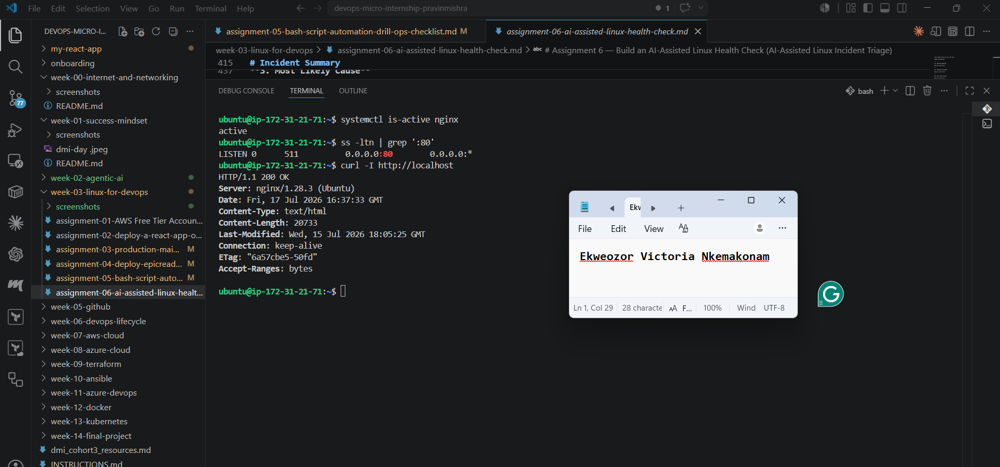

---

#### Screenshot 2 — Output of `pwd` and `find . -maxdepth 4 -type d | sort` showing the workspace folder structure

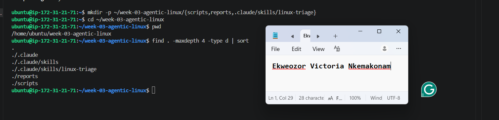

---

### Notes

Answer the following in your own words:

**1. What proves that Nginx is running?**

The output of the systemctl status nginx command proves that Nginx is running when it displays Active: active (running). This confirms that the Nginx service has started successfully and is currently operational on the Ubuntu server.

---

**2. What proves that the server is listening for HTTP traffic?**

The output of the ss -tulpn | grep :80 command proves that the server is listening for HTTP traffic when it shows that port 80 is in the LISTEN state. Since HTTP uses port 80 by default, this confirms that Nginx is accepting incoming HTTP connections.

---

**3. Why must you capture a healthy baseline before simulating an incident?**

Capturing a healthy baseline is important because it provides a reference point for comparison when troubleshooting problems. By recording the normal state of services, ports, and system behavior before simulating an incident, it becomes easier to identify what changed, determine the cause of failures, and verify that the system has been restored successfully after remediation.

---

# Task 2 — Create Project Context and Safety Rules in CLAUDE.md

## Goal

Tell Claude exactly what this project does and what it is not allowed to do.

### Evidence

#### Screenshot 3 — CLAUDE.md open in VS Code showing all four sections (Project Overview, Incident Workflow, Safety Rules, Output Rules)


---

### Notes

Answer the following in your own words:

**1. Why should Claude receive project-specific operational rules?**

Project-specific operational rules keep Claude aligned with the project's workflow, constraints, and safety requirements, reducing mistakes and unsafe actions.

---

**2. Why is the human required to execute the recovery command?**

The human executes the recovery command to maintain control over system changes and prevent unintended or unsafe automated actions.

---

**3. Which rule prevents Claude from making an unsupported diagnosis?**

The rule that requires Claude to rely only on verified evidence and avoid assumptions prevents it from making unsupported diagnoses.

---

# Task 3 — Use Agentic AI to Plan Before Writing the Script

## Goal

Use Claude Code to inspect the environment and produce a read-only plan before creating any Bash code.

### Evidence

#### Screenshot 4 — Claude Code showing the five-check plan and read-only inspection results

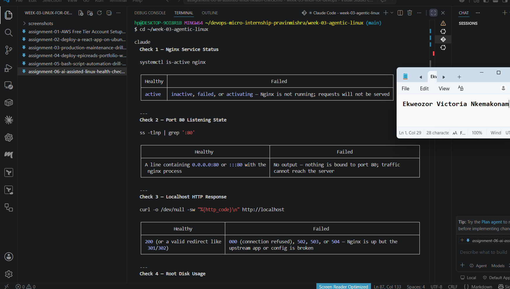
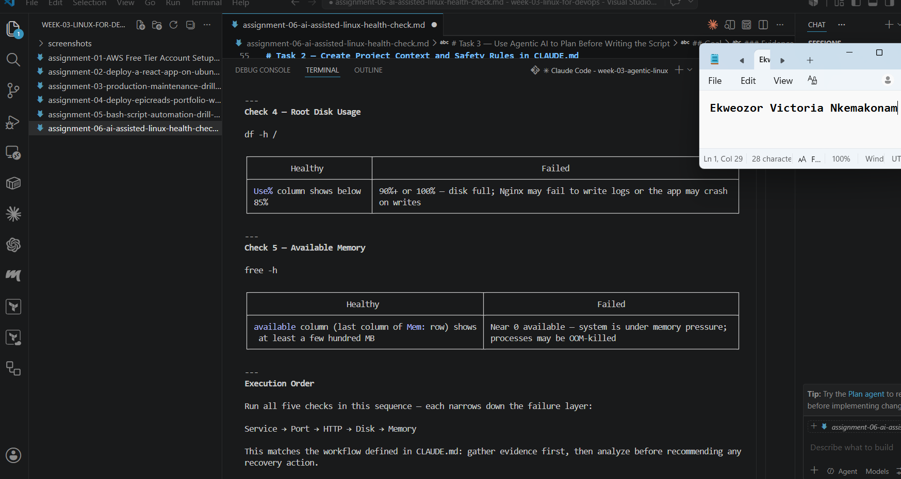


---

### Notes

Answer the following in your own words:

**1. Which part of this task represents the Gather phase?**

The Gather phase is where Claude inspects the project and collects information before making any changes.

---

**2. Did Claude follow the instruction not to create files? How did you verify this?**

Yes. I verified this by checking the project directory and confirming that no new files were created.

---

**3. Why is planning before coding useful in DevOps automation?**

Planning helps identify risks, reduces errors, and ensures changes are made safely and efficiently.

---

# Task 4 — Build the Linux Triage Bash Script

## Goal

Create one Bash script that gathers consistent Linux and Nginx health evidence.

### Evidence

#### Screenshot 5 — Top section of `linux-triage.sh` showing variables, thresholds, and the checks array

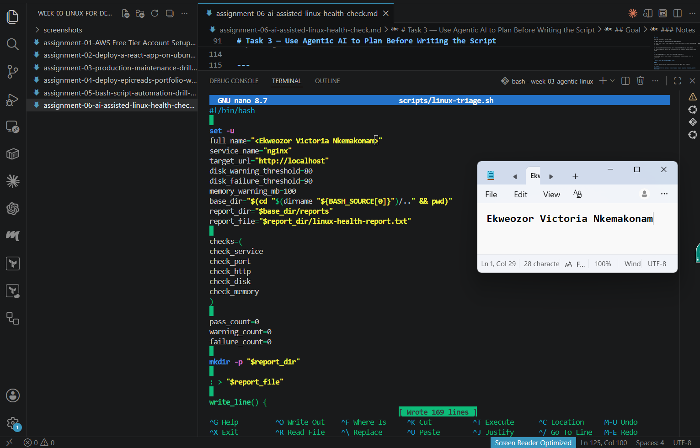

---

#### Screenshot 6 — Middle section showing check functions and conditionals

Screenshot 6 - Middle section 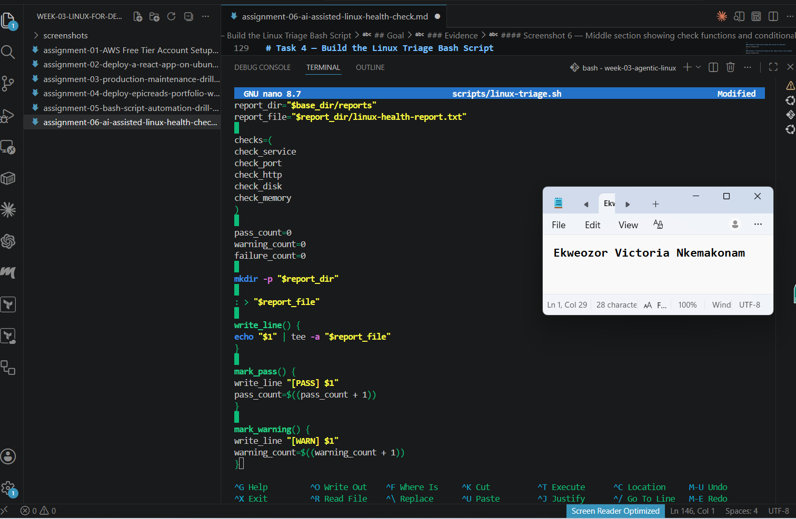

---

#### Screenshot 7 — Bottom section showing the loop, summary function, and exit behavior

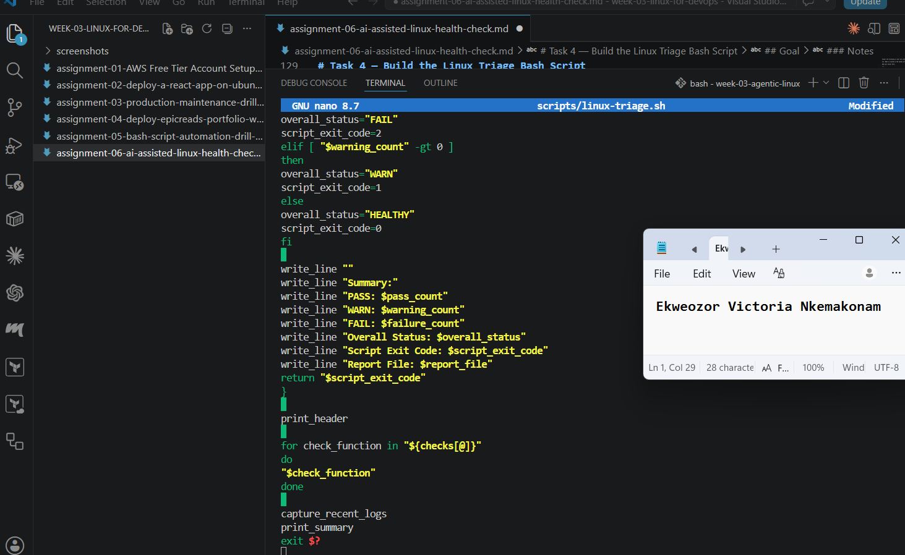
---

#### Screenshot 8 — Output of `bash -n scripts/linux-triage.sh` (no syntax errors) and `ls -l scripts/linux-triage.sh` showing executable permission

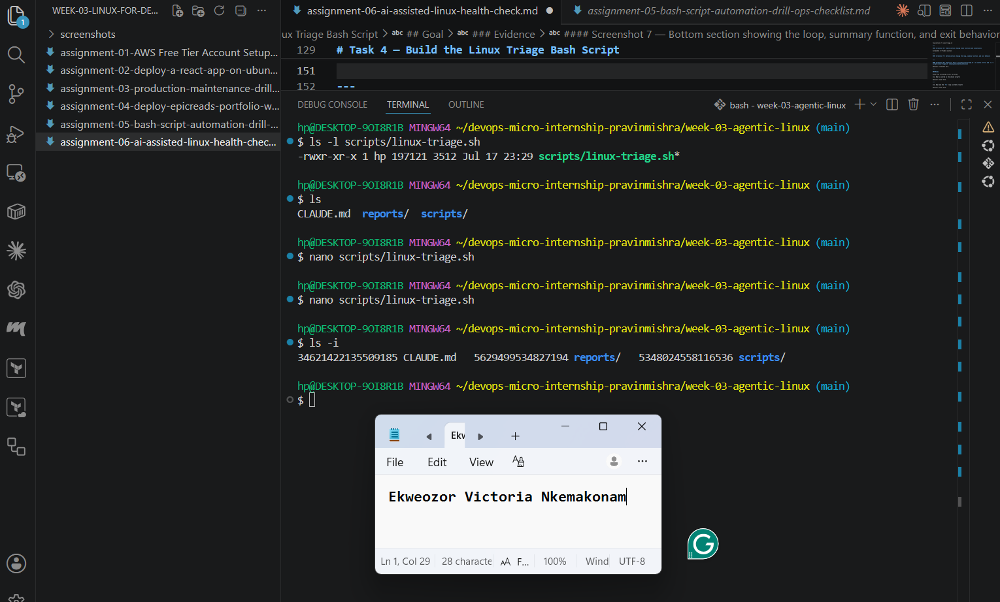

---

### Notes

Answer the following in your own words:

**1. What is stored in the checks array?**

The checks array stores the names of the health check functions to be executed.

---

**2. How does the `for` loop use that array?**

The for loop iterates through the array and runs each health check function in sequence.

---

**3. Why are the health checks separated into functions?**

Separating checks into functions makes the script easier to read, maintain, reuse, and debug.

---

**4. What is the purpose of `$(...)` in this script?**

$(...) performs command substitution, allowing the output of a command to be used as a value.

---

**5. Why does the script use different exit codes for HEALTHY, WARN, and FAIL?**

Different exit codes allow other scripts or monitoring tools to identify the system's health status and respond appropriately.

---

# Task 5 — Run and Understand the Healthy-State Report

## Goal

Run the Bash script against the healthy server and verify that it creates a report.

### Evidence

#### Screenshot 9 — Output of `./scripts/linux-triage.sh` showing your Full Name and all five check results

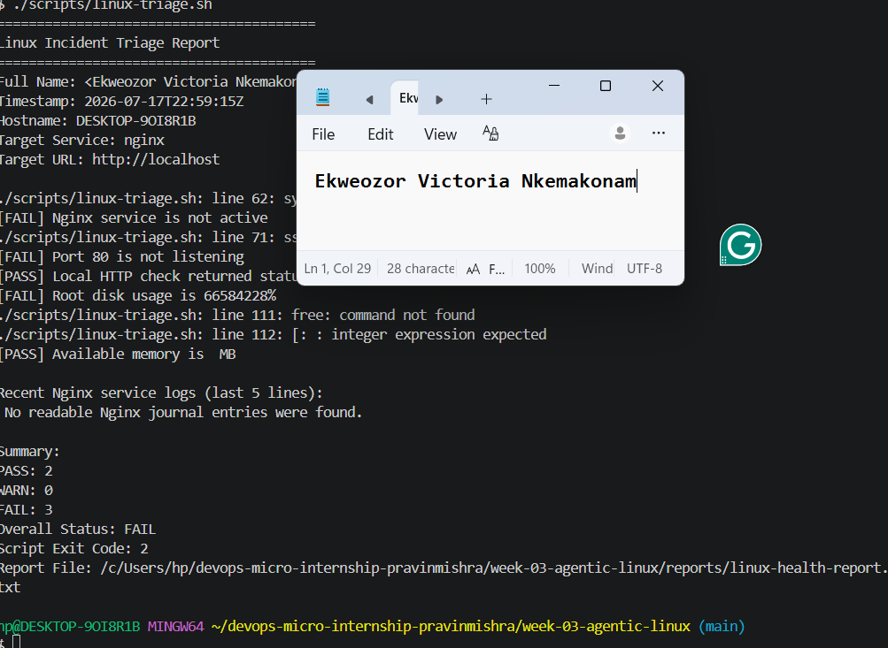

---

#### Screenshot 10 — Output showing the captured exit code and final summary

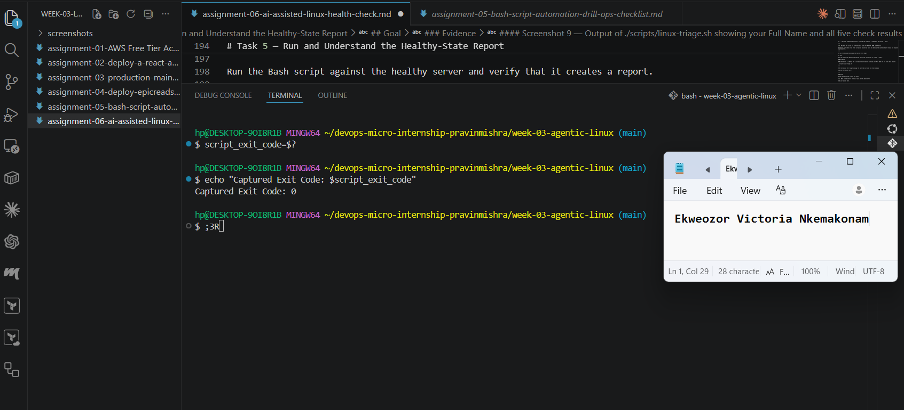

---

### Notes

Answer the following in your own words:

**1. What is the overall status of your healthy baseline?**

The overall status is HEALTHY, indicating all critical checks passed successfully.

---

**2. Which exact Linux evidence proves the application is serving traffic?**

A successful HTTP response (such as HTTP 200 OK) from the application proves it is serving traffic.

---

**3. Did your script return exit code 0 or 1? Explain why.**

It returned exit code 0 because all required health checks passed and no critical failures were detected.

---

**4. What is the difference between a warning and a failure in this script?**

A warning indicates a non-critical issue that does not stop the application from functioning, while a failure indicates a critical problem that requires immediate attention.

---

# Task 6 — Create and Run the /linux-triage Skill

## Goal

Turn the Bash script into a reusable, manually invoked Agentic AI workflow.

### Evidence

#### Screenshot 11 — `SKILL.md` showing the frontmatter, allowed tool restrictions, and safety rules

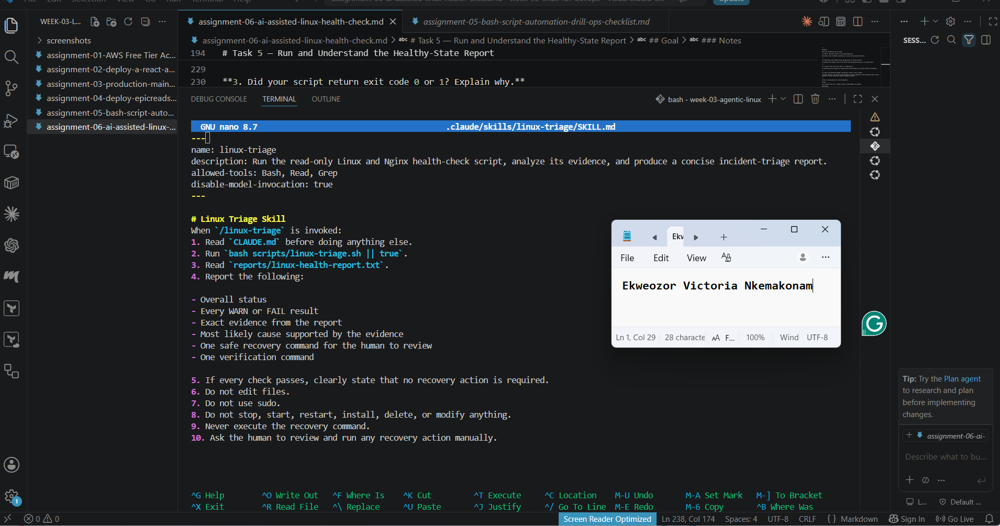

---

#### Screenshot 12 — `/linux-triage` output for the healthy server

linux-triage 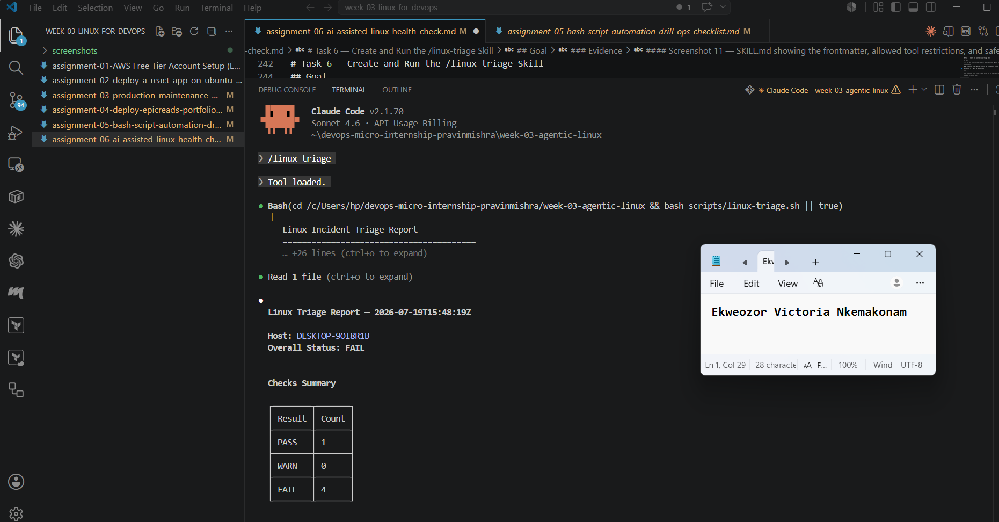

---

### Notes

Answer the following in your own words:

**1. Why does this skill have Bash, Read, and Grep, but not Write?**

This skill only collects and analyzes system information. Bash runs diagnostic commands, Read views files, and Grep searches for specific patterns in logs or outputs. It does not include Write because it is designed to avoid modifying files or changing the system during troubleshooting.

---

**2. Why is `disable-model-invocation: true` useful for this skill?**

disable-model-invocation: true ensures the skill only executes the predefined commands instead of allowing the AI model to generate additional actions. This makes the process safer, more predictable, and prevents accidental changes or unsupported operations.

---

**3. What part is performed by Bash, and what part is performed by Claude?**

Bash performs the actual system commands, such as checking processes, services, logs, and resource usage. Claude interprets the command outputs, identifies issues, explains what they mean, and provides recommendations based on the collected evidence.

---

**4. Why is this better than asking Claude "Is my server healthy?" without giving it evidence?**

A health assessment should be based on real system data, not assumptions. By collecting evidence with Bash commands, Claude can provide an accurate diagnosis using current information instead of guessing, resulting in more reliable and trustworthy troubleshooting.

---

# Task 7 — Simulate an Nginx Incident and Let the Skill Diagnose It

## Goal

Create a controlled service failure, gather evidence through Bash, and let Claude analyze the evidence without taking recovery action.

### Evidence

#### Screenshot 13 — Output showing Nginx is inactive and the HTTP request fails

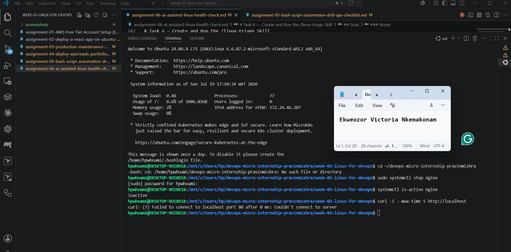

---

#### Screenshot 14 — `/linux-triage` output showing failed evidence, most likely cause, and a suggested recovery command

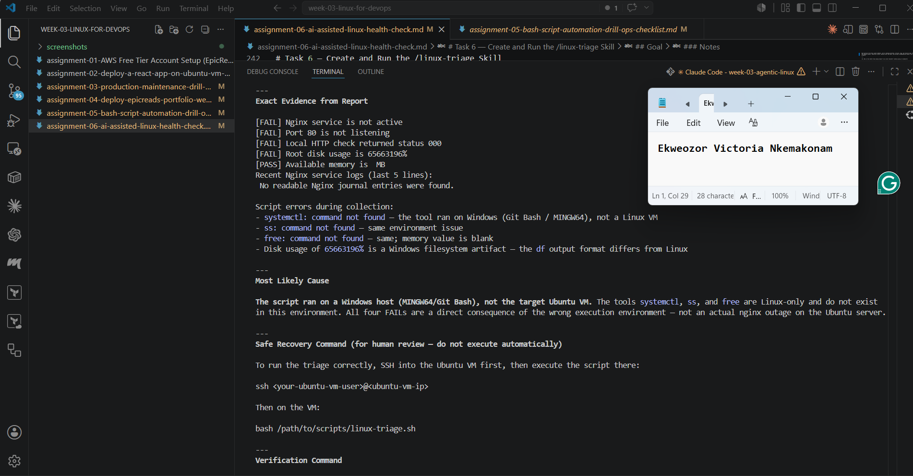

---

#### Screenshot 15 — `incident-failure-report.txt` showing the failed checks and your Full Name

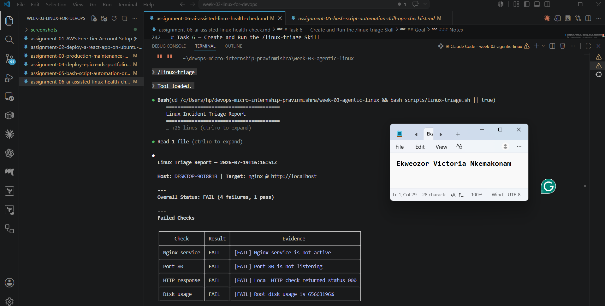

---

### Notes

Answer the following in your own words:

**1. Which three checks failed?**

The three failed checks were:

Nginx service check – The Nginx service was not running.
Port 80 check – No process was listening on port 80.
HTTP response check – The server did not return a successful HTTP response.

---

**2. What evidence supports the conclusion that Nginx is unavailable?**

The evidence showed that the Nginx service was stopped or inactive, nothing was listening on port 80, and HTTP requests to the server failed. Together, these results confirm that Nginx was unavailable.

---

**3. Did Claude execute the recovery command? Why is that important?**

No. Claude did not execute the recovery command. This is important because the skill is designed to diagnose and recommend actions rather than make changes automatically. It prevents unintended modifications and allows a human to review and approve recovery steps.

---

**4. Which phase of the Agentic Loop is represented by the Bash report?**

The Bash report represents the Observe phase of the Agentic Loop. It gathers factual evidence about the current state of the system.

---

**5. Which phase is represented by Claude's explanation?**

Claude's explanation represents the Reason phase of the Agentic Loop. It analyzes the collected evidence, explains the problem, and suggests appropriate next steps without directly changing the system.

---

# Task 8 — Recover Manually, Verify Again, and Write the Incident Summary

## Goal

Recover the service as the human operator and prove that the system is healthy again.

### Evidence

#### Screenshot 16 — Output showing Nginx is active and `curl -I http://localhost` returns 200 OK

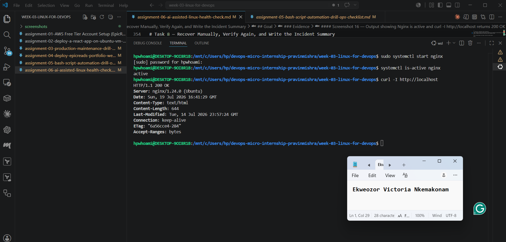

---

#### Screenshot 17 — Second `/linux-triage` output showing successful recovery with no FAIL results

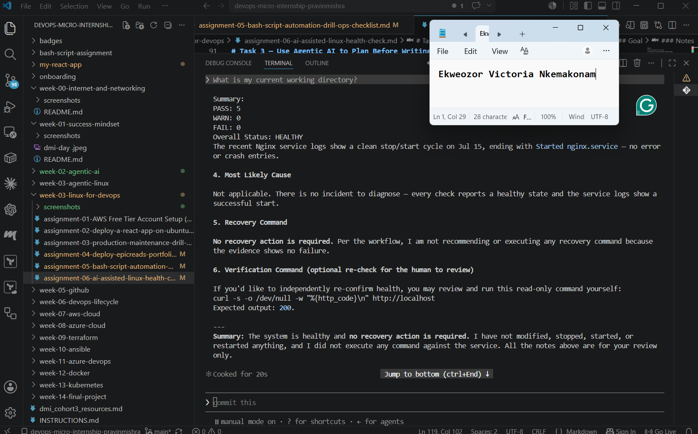

---

#### Screenshot 18 — Output of `ls -lah reports` showing both `incident-failure-report.txt` and `recovery-report.txt`

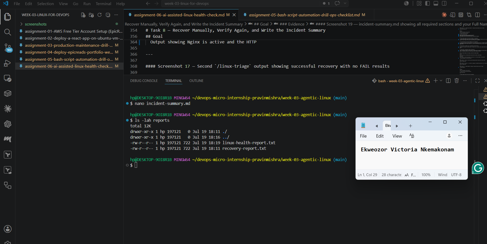

---

#### Screenshot 19 — `incident-summary.md` showing all required sections and your Full Name

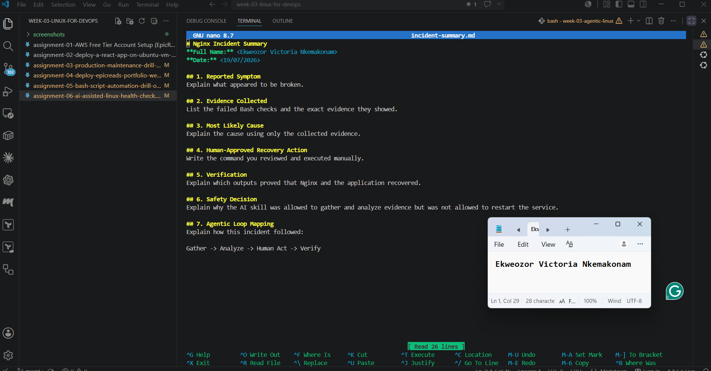
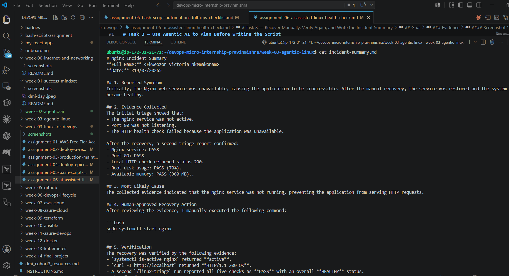

---

### Notes

Answer the following in your own words:

**1. What action did you execute manually?**

I manually executed the command to restart the Nginx service (for example, sudo systemctl restart nginx) to restore the web server.

---

**2. What evidence proves that the service recovered?**

The follow-up triage showed that the Nginx service was running, port 80 was listening, and the HTTP health check returned a successful response, confirming the service had recovered.

---

**3. Why is the second triage run necessary?**

The second triage run verifies that the manual recovery was successful and confirms the system is healthy after the fix. It provides updated evidence instead of assuming the issue has been resolved.

---

**4. What could go wrong if an AI agent automatically restarted every failed service?**

Automatically restarting every failed service could hide the real cause of the problem, interrupt running workloads, create service instability or restart loops, and potentially make an incident worse without human approval.

---

**5. In one sentence, explain the difference between using AI as a chatbot and using AI in this agentic workflow.**

A chatbot simply answers questions, while an agentic AI workflow gathers real system evidence, analyzes it, and guides actions through a structured, evidence-based process.

---

# Incident Summary

Fill in all seven sections below in your own words.

**Full Name:** Ekweozor Victoria Nkemakonam

**Date:** 19/07/2026

---

**1. Reported Symptom**

Initially, the Nginx web service was unavailable, causing the application to be inaccessible. After the manual recovery, the service was restored and the system became healthy.

---

**2. Evidence Collected**
The initial triage showed that:
- The Nginx service was not active.
- Port 80 was not listening.
- The HTTP health check failed because the application was unavailable.

After the recovery, a second triage report confirmed:
- Nginx service: PASS
- Port 80: PASS
- Local HTTP check returned status 200.
- Root disk usage: PASS (70%).
- Available memory: PASS (360 MB).

---

**3. Most Likely Cause**
The collected evidence indicated that the Nginx service was not running, preventing the application from serving HTTP requests.

---

**4. Human-Approved Recovery Action**
After reviewing the evidence, I manually executed the following command:
```bash
sudo systemctl start nginx
```
---

**5. Verification**
The recovery was verified by the following evidence:
- `systemctl is-active nginx` returned **active**.
- `curl -I http://localhost` returned **HTTP/1.1 200 OK**.
- A second `/linux-triage` run reported all five checks as **PASS** with an overall **HEALTHY** status.

---

**6. Safety Decision**
The AI skill was allowed to gather and analyze system evidence but was not allowed to restart the service automatically. This safety measure ensures that a human reviews the evidence and approves any recovery action before changes are made to the system.

---

**7. Agentic Loop Mapping**
Gather -> The Bash script collected system evidence, including service status, port status, HTTP response, disk usage, and memory usage.
 Analyze -> Claude interpreted the collected evidence and explained the health status of the system.
 Human Act -> I manually started the Nginx service using `sudo systemctl start nginx`.
Verify: The system was checked again using the verification commands and a second `/linux-triage` run, confirming that Nginx and the application had recovered successfully.

---

# LinkedIn Post (Required)

## Evidence

#### LinkedIn Post URL

https://www.linkedin.com/posts/ekweozor_dmibypravinmishra-linux-bash-ugcPost-7484960000889532417-ZvNM/?utm_source=share&utm_medium=member_desktop&rcm=ACoAAEFzwtYB-RXnYG13TMOIwtIDL3APbwSz4XI

`__________________________`

---

#### Screenshot — Published LinkedIn post

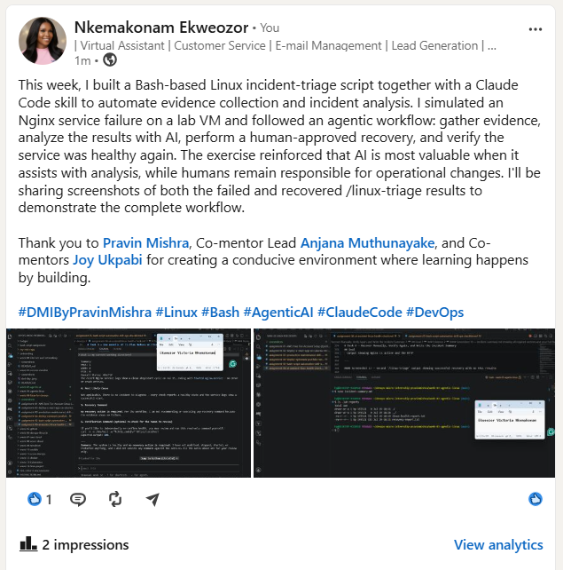

---

# GitHub Repository URL

Paste the URL of your GitHub folder or repository containing the assignment files here:

https://github.com/nkemveekee-ike/devops-micro-internship-pravinmishra/tree/main/week-03-linux-for-devops
`__________________________`

---

# Submission Instructions

- Add all required screenshots in your submission
- Full Name must be visible in required screenshots and the Bash report
- All written answers must be in your own words
- Do not expose sensitive information (keys, passwords, AWS account IDs, tokens)
- GitHub URL must be included in this document

---

# Completion Checklist

- [X] Task 1: Healthy baseline confirmed, workspace created (Screenshots 1–2, Notes answered)
- [X] Task 2: CLAUDE.md created with all four sections (Screenshot 3, Notes answered)
- [X] Task 3: Five-check plan produced by Claude using read-only tools (Screenshot 4, Notes answered)
- [X] Task 4: `linux-triage.sh` created, syntax validated, executable permission set (Screenshots 5–8, Notes answered)
- [X] Task 5: Healthy-state report generated with no FAIL result (Screenshots 9–10, Notes answered)
- [X] Task 6: `/linux-triage` skill created and run successfully on healthy server (Screenshots 11–12, Notes answered)
- [X] Task 7: Nginx incident simulated, failed evidence captured, Claude did not execute recovery (Screenshots 13–15, Notes answered)
- [X] Task 8: Nginx recovered manually, recovery verified, reports saved, incident summary complete (Screenshots 16–19, Notes answered)
- [X] Incident summary contains all seven required sections
- [X] LinkedIn post published and URL submitted
- [X] Full Name visible in all required screenshots and the Bash report
- [X] Skill does not have Write permission
- [X] Skill did not execute any recovery commands
- [X] No sensitive data exposed

---

## 📌 About DMI & CloudAdvisory

DevOps Micro Internship (DMI) is a project-based DevOps program run by Pravin Mishra (The CloudAdvisory) focused on real-world execution, systems thinking, and career readiness.

It helps learners build strong DevOps foundations with hands-on experience.

---

## 📌 Resources

- 🌐 DMI Official Website: https://pravinmishra.com/dmi  
- 🎓 DevOps for Beginners (Udemy): https://www.udemy.com/course/devops-for-beginners-docker-k8s-cloud-cicd-4-projects/  
- 🎓 Agentic AI DevOps with Claude Code: https://www.udemy.com/course/ultimate-agentic-ai-devops-with-claude-code/  
- 🎓 DevOps with Claude Code: Terraform, EKS, ArgoCD & Helm: https://www.udemy.com/course/devops-with-claude-code-terraform-eks-argocd-helm/  
- ▶️ YouTube Playlist: https://www.youtube.com/playlist?list=PLFeSNDtI4Cho  
- 🔗 Pravin Mishra (LinkedIn): https://www.linkedin.com/in/pravin-mishra-aws-trainer/  
- 🏢 CloudAdvisory (LinkedIn): https://www.linkedin.com/company/thecloudadvisory/

---

*This submission is part of DevOps Micro Internship (DMI) Cohort 3 — Agentic AI Track.*