# Assignment 4 — Gotto Job: Backlog Refinement & Sprint 1 in Jira

Part of the DevOps Micro Internship (DMI) Cohort 3 with Agentic AI

---

## Purpose

In this 90-minute, time-boxed exercise, you will act as a Scrum team — or run in Solo Mode, playing every role yourself — to turn the Gotto Job template into a value-ordered backlog, estimate the work in story points, plan Sprint 1, open the burndown chart, and ship one small UI-only increment (text, color, spacing, a label, or a CTA — no backend changes).

---

# Task 1 — Roles & Mode Setup (Team vs Solo)

## Goal

Choose Team Mode or Solo Mode, and document how each Scrum role (Product Owner, Scrum Master, Dev Lead, DevOps Lead) was handled.

### Evidence

#### Screenshot 1 — Jira "Create project" screen, or the project sidebar after creation

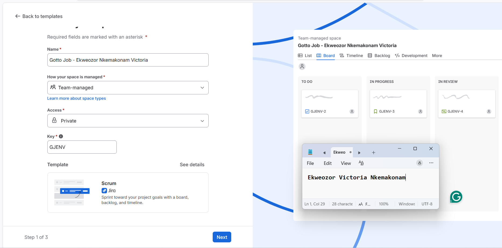

---

### Notes

Write one line for each role: PO (what you prioritized), SM (how you ensured process), Dev Lead (what you built), DevOps Lead (how you shipped).

Solo Mode — I performed all four roles (Product Owner, Scrum Master, Dev Lead, and DevOps Lead) myself for this exercise.

PO: I prioritized high-value UI improvements that improve user trust, clarity, and job discovery, such as the hero tagline and CTA updates.

SM: I ensured the Scrum process was followed by organizing the backlog, estimating stories, planning the sprint, and tracking delivery activities.

Dev Lead: I built a small UI-only improvement in the Gotto Job frontend, focusing on text, styling, and user experience changes.

DevOps Lead: I shipped the change by committing the code, deploying it to the hosting environment, and verifying the live update.

---

# Task 2 — Create the Jira Project (Team-managed → Scrum)

## Goal

Create a Team-managed Scrum project named `Gotto Job – Team <#>` (Team Mode) or `Gotto Job – <YourName>` (Solo Mode).

### Evidence

#### Screenshot 2 — Project created page showing the project name and key

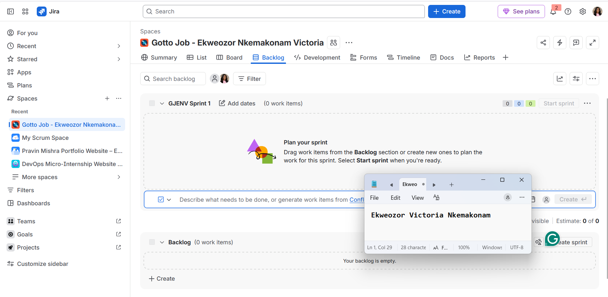

---

# Task 3 — Create the Epic

## Goal

Create the Epic `Improve Gotto Job UI discoverability & trust` to group the UI improvement initiative.

### Evidence

#### Screenshot 3 — Backlog showing the Epic panel with the Epic visible

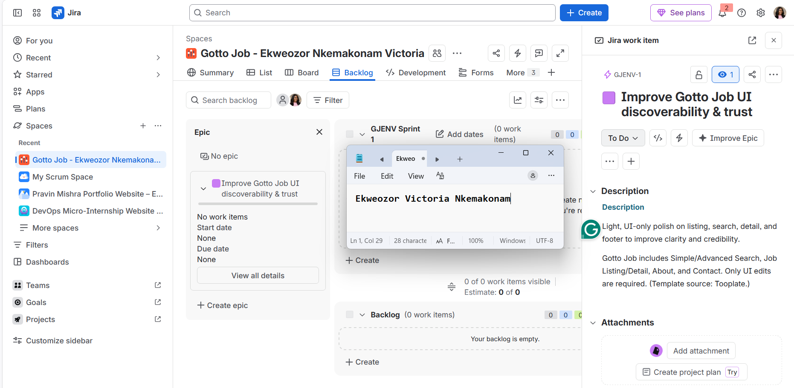

---

# Task 4 — Seed the Product Backlog (6–8 Stories + Fibonacci Points + Ranking)

## Goal

Create at least six Stories under the Epic, estimate each with 1, 2, or 3 story points, and rank them by value.

### Evidence

#### Screenshot 4 — Backlog showing the Epic and at least six Stories under it

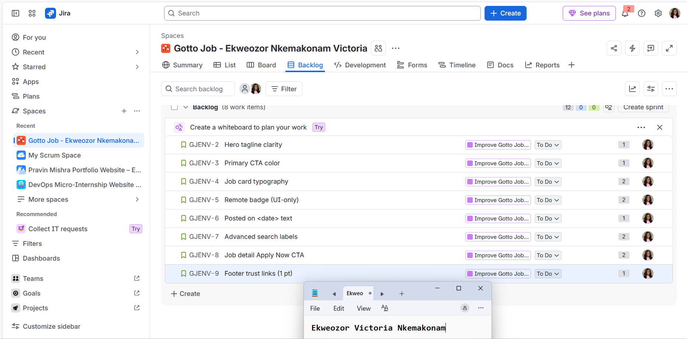

---

#### Screenshot 5 — One Story opened showing its Story Points and acceptance criteria filled in

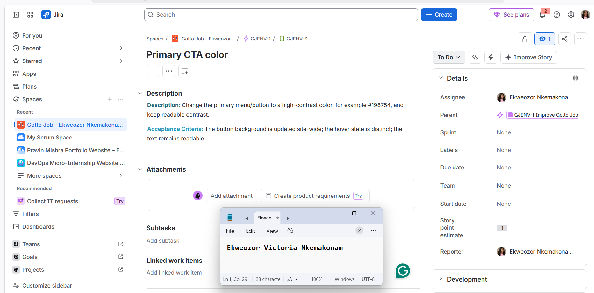

---

# Task 5 — Planning Poker (Estimate + Debate Notes)

## Goal

Confirm the Story Points (1, 2, or 3) for each Story and record brief reasoning for each estimate.

### Evidence

#### Screenshot 6 — Backlog showing Story Points visible, or two or three Stories opened showing their points

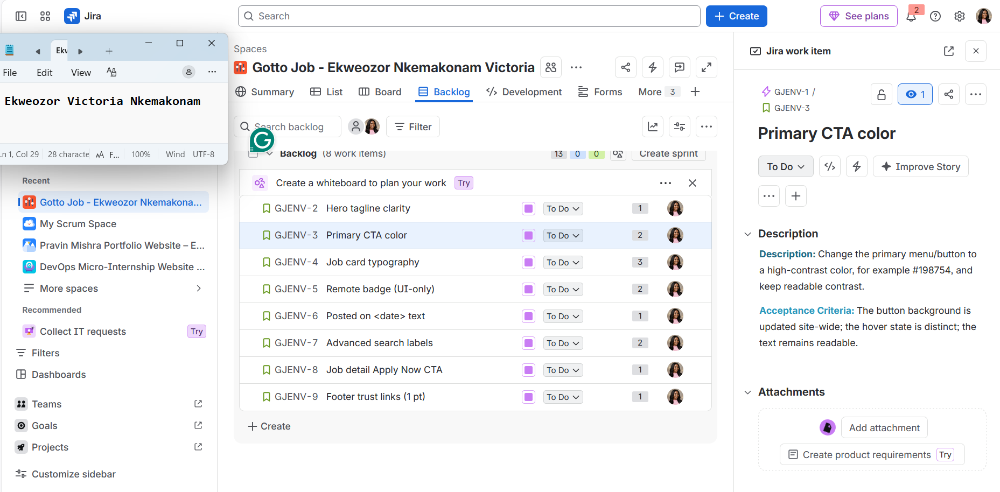

---

### Notes

For each story, explain in one or two lines why it is a 1, 2, or 3 (mention any debate, even in Solo Mode).

Hero tagline clarity has 1 point
This only involves replacing the existing hero text with the one provided in the assignment. It's a quick text edit with almost no complexity.

Primary CTA color point 2
This starts with changing the CTA/button color in the CSS, but I also need to update the hover effect and make sure the new color looks good and remains easy to read everywhere it's appears.

Job card typography point 3
This change affects every job card on the listing page. After increasing the font size and weight, I need to check different screen sizes to make sure the layout still looks balanced and nothing breaks.

Remote badge (UI-only) point 2
A new "REMOTE" badge has to be added to the job cards. Besides adding the badge, I also need to position and style it so it fits nicely with the existing design.

Posted on <date> text point 1
This is just adding a static "Posted on" date to each job card. It's straightforward and doesn't affect any other part of the site.

Advanced search labels point 2
There are several labels and placeholders to update, so I have to go through the whole form and make sure everything is clear and properly aligned.

Job detail Apply Now CTA point 1
This is simply adding an "Apply Now" button with a basic link. The main thing is making sure it's visible and easy to click.

Footer trust links point 1
I only need to add the About and Contact links to the footer and check that they point to the correct pages. It's a small navigation update.

Solo Mode Debate:
While estimating the stories, I spent a little more time on Job Card Typography. At first, I thought it could be 2 points since it's mainly a CSS change, but I realized it affects every job card on the page. I would also need to test it on different screen sizes to make sure the layout still looks good, so I decided 3 points was a better estimate.
---

# Task 6 — Sprint Planning: Create Sprint 1 + Sprint Goal + Scope

## Goal

Create Sprint 1, move three or four Stories into it (approximately 3–6 points), set the Sprint Goal, and break each selected Story into Build, Verify, Deploy, and Screenshot Sub-tasks.

### Evidence

#### Screenshot 7 — Sprint 1 with the selected Stories inside it

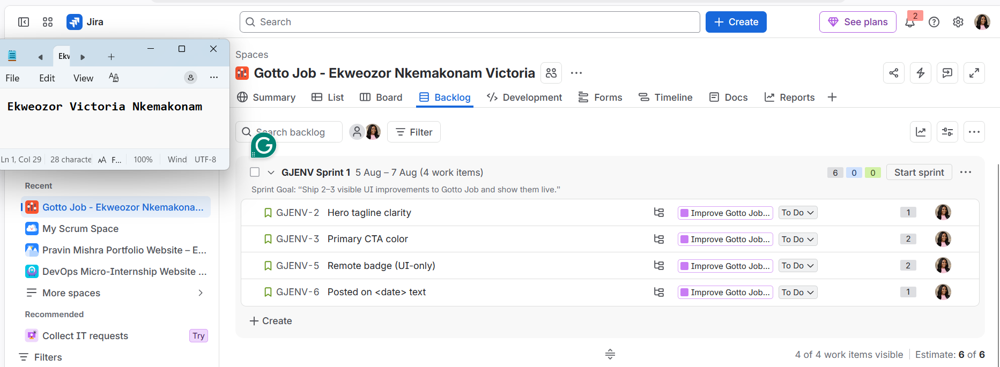

---

#### Screenshot 8 — One Story showing the Sub-tasks created

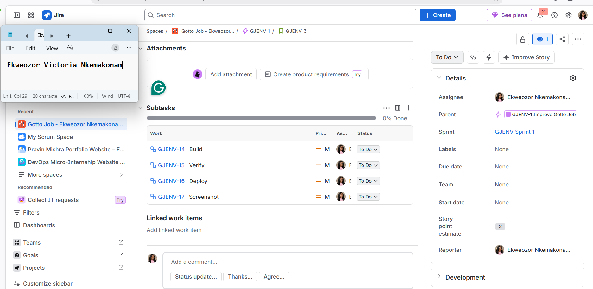

---

# Task 7 — Reports: Open Burndown Chart

## Goal

Open the Burndown Chart and confirm it exists for Sprint 1. It is acceptable if the chart is not yet populated.

### Evidence

#### Screenshot 9 — Burndown Chart page opened, even if empty

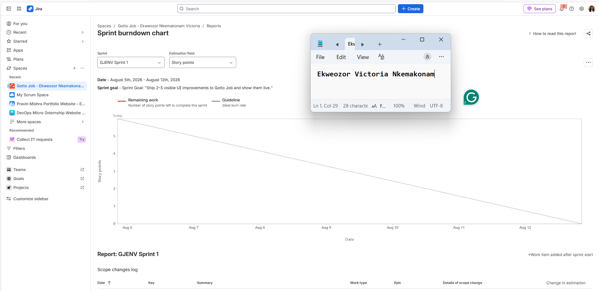

---

# Task 8 — Ship One Small Increment (Build + Deploy + Proof)

## Goal

Implement one small UI-only Story from Sprint 1, commit it, deploy it live, and move the Story and its Sub-tasks to Done in Jira.

### Evidence

#### Screenshot 10 — Jira board showing the Story moved to Done

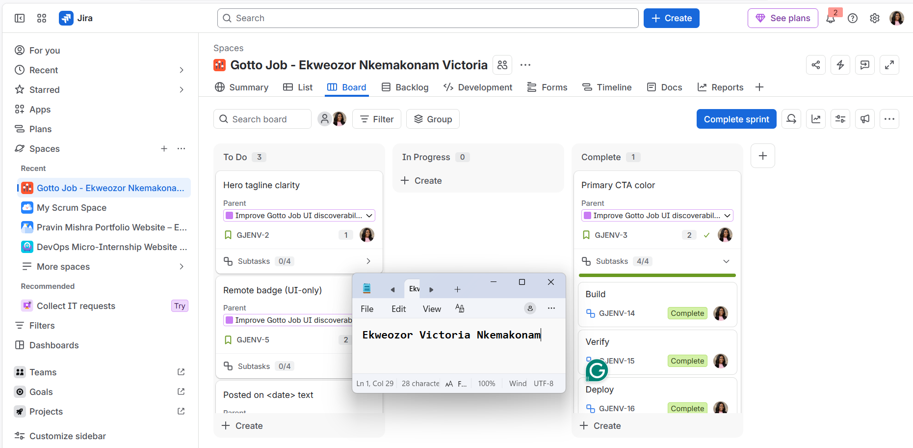

---

#### Screenshot 11 — Git commit output

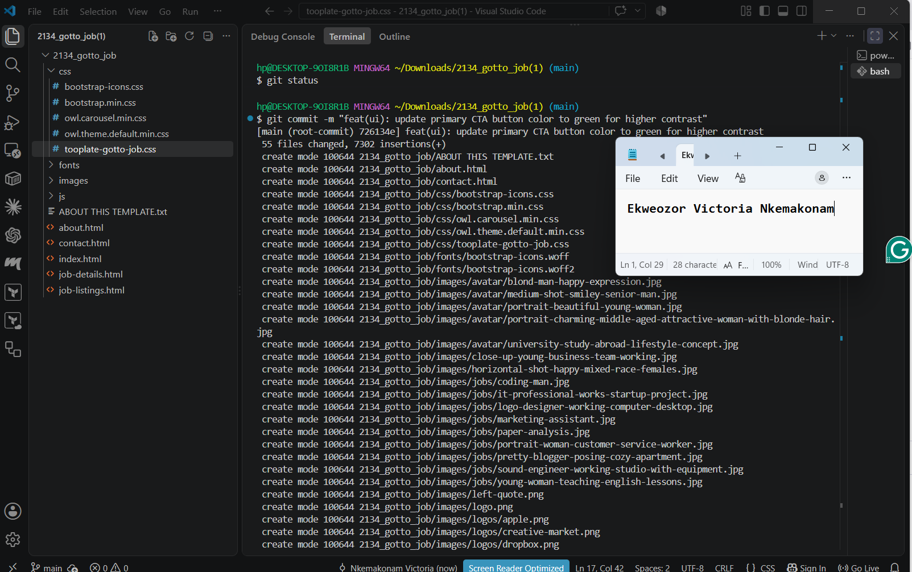

---

#### Screenshot 12 — Live URL in the browser showing the UI change, with the URL visible

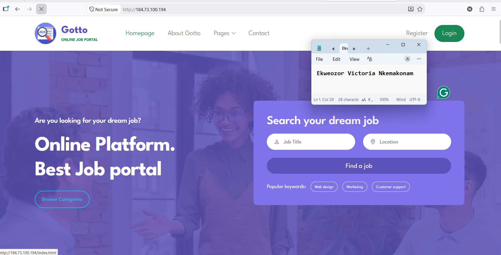

---

# Task 9 — Retro Notes (Scrum Pillar + Value)

## Goal

Add a retro comment covering what went well, what to improve, one Scrum pillar observed (Transparency, Inspection, or Adaptation), and one Scrum value (Openness, Focus, Commitment, Courage, or Respect).

### Evidence

#### Screenshot 13 — Jira retro comment visible

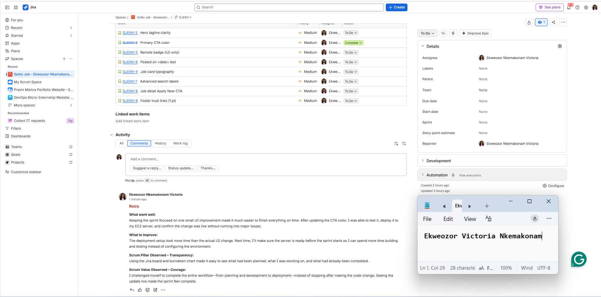

---

# Task 10 — LinkedIn Post (Mandatory)

## Goal

Publish a LinkedIn post about what you delivered, including your live URL, three to five lines on what you did and learned, and one screenshot (Burndown Chart, Sprint board, or the live UI change).

## Evidence

#### LinkedIn Post URL

https://www.linkedin.com/posts/ekweozor_scrum-agile-jira-share-7490882364554858497-y1m5/?utm_source=share&utm_medium=member_desktop&rcm=ACoAAEFzwtYB-RXnYG13TMOIwtIDL3APbwSz4XI

---

#### Screenshot 14 — Published LinkedIn post

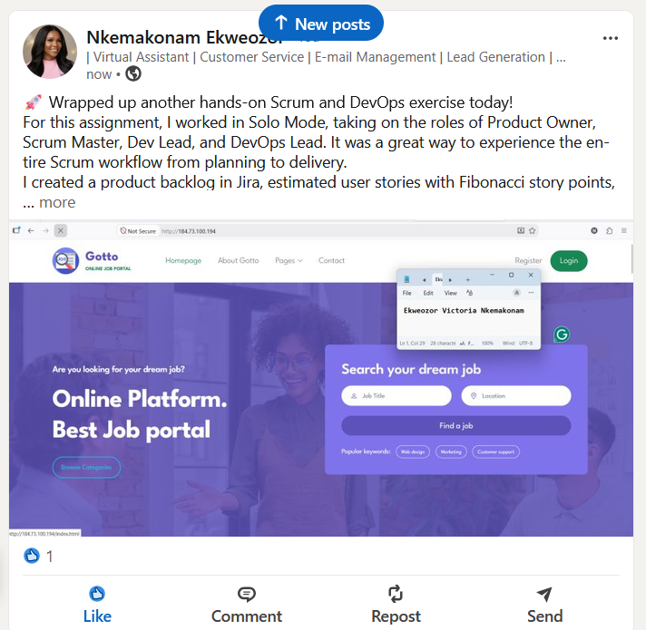

---

# Submission Instructions

- Add all 14 required screenshots
- Full name must be visible in required screenshots
- Do not expose sensitive information (keys, passwords, account IDs)

---

# Completion Checklist

- [X] Task 1: Team Mode or Solo Mode selected and all four roles documented (Screenshot 1 & Notes)
- [X] Task 2: Team-managed Scrum project created with the required name (Screenshot 2)
- [X] Task 3: UI improvement Epic created (Screenshot 3)
- [X] Task 4: 6–8 Stories added under the Epic and ranked by value (Screenshots 4 & 5)
- [X] Task 5: Story Points set (1, 2, or 3) with reasoning recorded (Screenshot 6 & Notes)
- [X] Task 6: Sprint 1 created with Sprint Goal, 3–4 Stories, and Sub-tasks (Screenshots 7 & 8)
- [X] Task 7: Burndown Chart opened (Screenshot 9)
- [X] Task 8: One UI-only increment implemented, committed, deployed, and verified (Screenshots 10–12)
- [X] Task 9: Retro comment with one Scrum pillar and one Scrum value (Screenshot 13)
- [X] Task 10: Mandatory LinkedIn post published with the live URL, backlog refinement, Sprint planning, one shipped increment, proof, and Screenshot 14
- [X] Full Name visible in required screenshots
- [X] No sensitive data exposed

---

## 📌 About DMI & CloudAdvisory

DevOps Micro Internship (DMI) is a project-based DevOps program run by Pravin Mishra (The CloudAdvisory) focused on real-world execution, systems thinking, and career readiness.

It helps learners build strong DevOps foundations with hands-on experience.

---

## 📌 Resources

- 🌐 DMI Official Website: https://dmi.pravinmishra.com?utm_source=github&utm_medium=readme  
- 🎓 University: https://university.pravinmishra.com?utm_source=github&utm_medium=readme  
- 💬 Discord Community: https://discord.pravinmishra.com?utm_source=github&utm_medium=readme  
- 📝 Blog: https://dmi.pravinmishra.com/blog?utm_source=github&utm_medium=readme  
- ▶️ YouTube Playlist: https://www.youtube.com/playlist?list=PLFeSNDtI4Cho  
- 🔗 Pravin Mishra (LinkedIn): https://www.linkedin.com/in/pravin-mishra-aws-trainer/  
- 🏢 CloudAdvisory (LinkedIn): https://www.linkedin.com/company/thecloudadvisory/

---

*This submission is part of DevOps Micro Internship (DMI) Cohort 3 — Agentic AI Track.*
