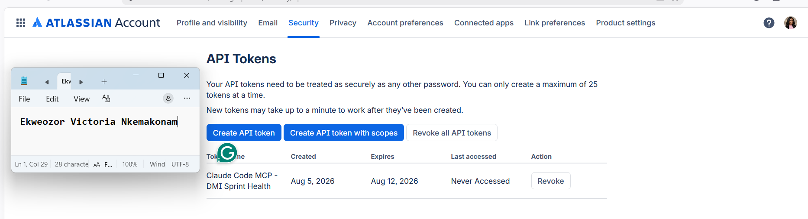
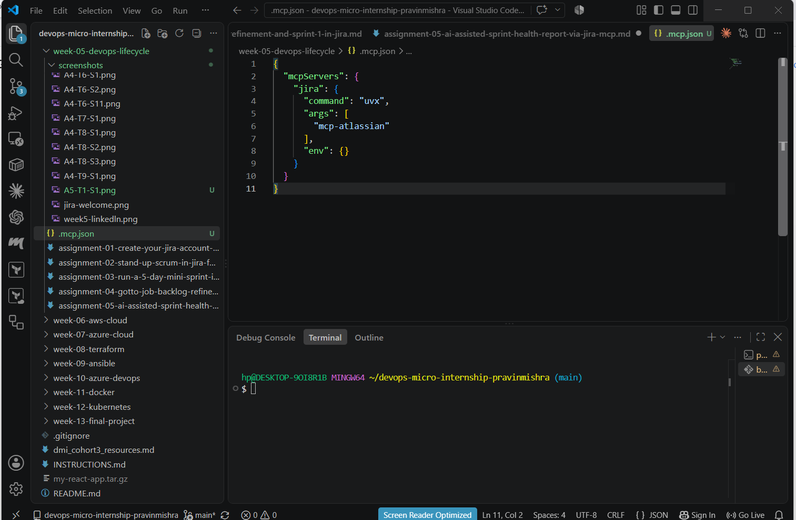
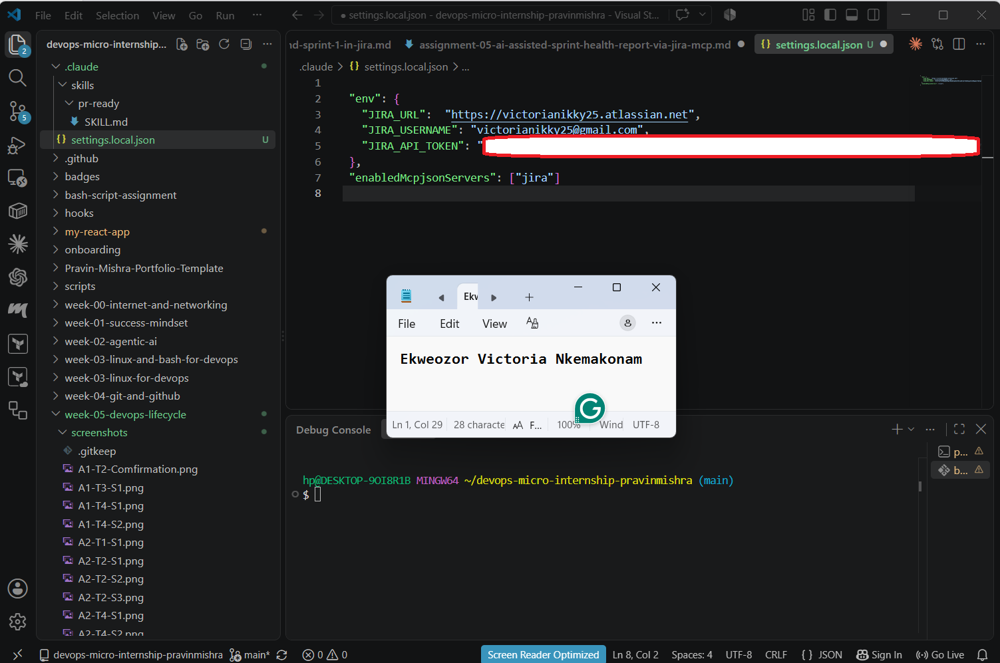
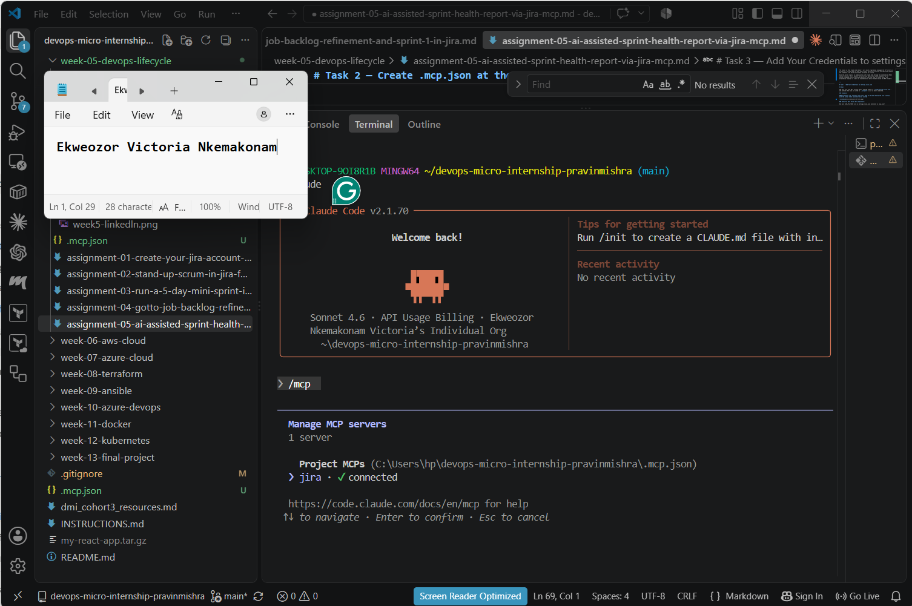
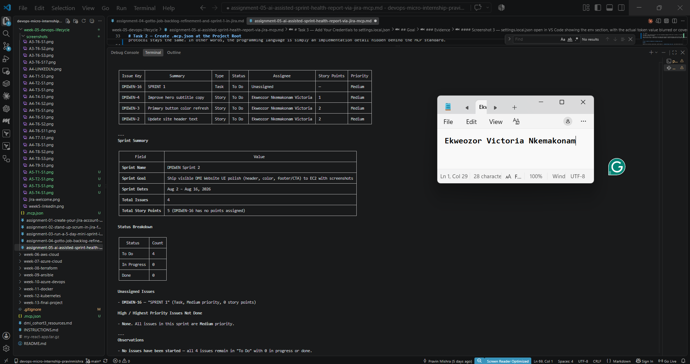
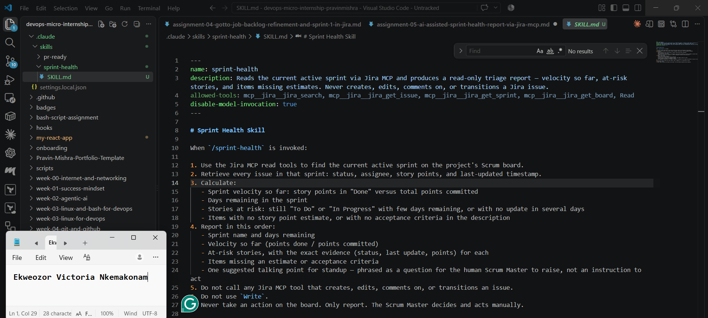
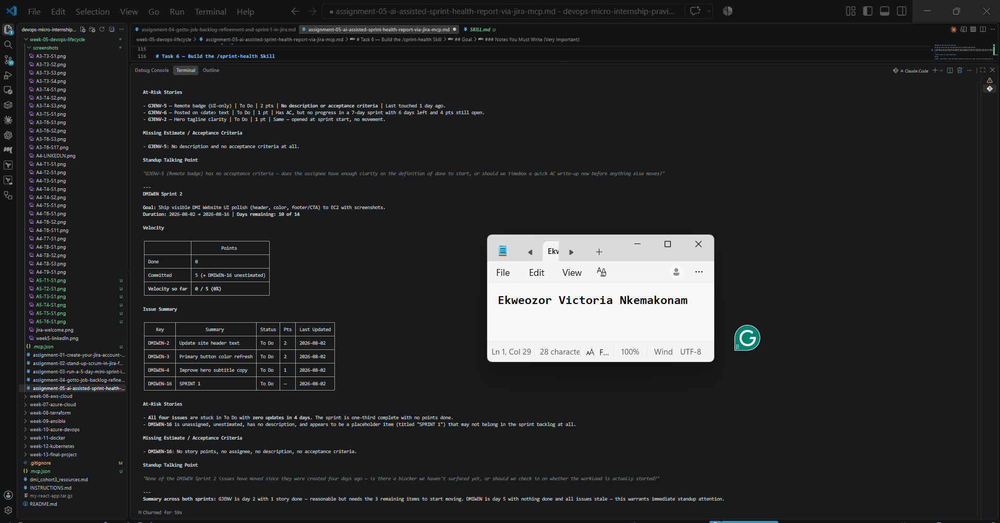
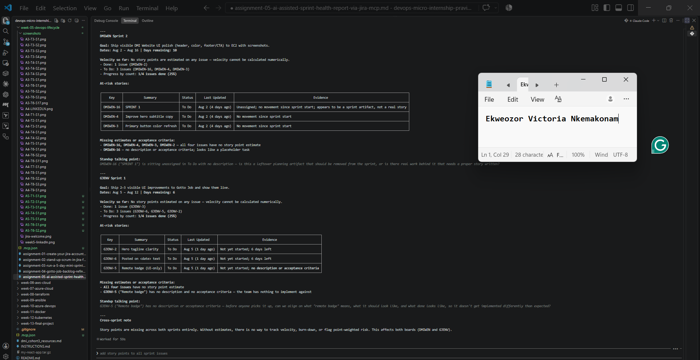
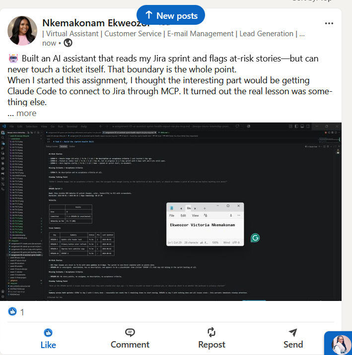

# Assignment 5 — AI-Assisted Sprint Health Report via Jira MCP

Part of the DevOps Micro Internship (DMI) Cohort 3 with Agentic AI

---

## Purpose

In this assignment, you will connect Claude Code to your Jira board through an MCP server, the same way you connected it to GitHub in Week 2, and build a read-only `/sprint-health` skill. The skill reads your current sprint through Jira's API and reports sprint velocity, stories at risk of missing the sprint, and items missing an estimate — but it must never create, edit, comment on, or transition a single ticket itself. You will prove that boundary holds by making a real change on the board yourself and confirming the skill only ever reports, never acts.

---

# Task 1 — Create a Jira API Token

## Goal

Generate an API token from your Atlassian account that the MCP server will use to authenticate with your Jira site. Do not screenshot the token value itself.

### Evidence

#### Screenshot 1 — Jira API token creation confirmation page showing the token name, with the token value not visible

### Notes You Must Write (Very Important):

Why does the MCP server need your site URL and account email in addition to the token?

The API token by itself isn't enough to connect to Jira. The site URL tells Claude which Jira workspace to connect to, while my Atlassian email identifies the account that owns the token. The token then verifies my identity, so all three pieces are needed for a secure connection.

---

# Task 2 — Create .mcp.json at the Project Root

## Goal

Create or update `.mcp.json` at your project root with a Jira MCP server block, following the same shape as the GitHub MCP server you configured in Week 2.

### Evidence

#### Screenshot 2 — `.mcp.json` open in VS Code showing the Jira server configuration

### Notes You Must Write (Very Important):

Compare this jira block to the github block from Week 2 Assignment 5. The GitHub server ran via npx (a Node.js package); this one runs via uvx (a Python package) — what stays exactly the same shape despite that difference, and why doesn't Claude Code care which language a given MCP server is written in?

Although `npx` is used to run a Node.js package and `uvx` is used to run a Python package, the configuration looks exactly the same. Both use a JSON object that specifies the `command`, an `args` array, and an `env` object.

The reason is that Claude Code doesn't care which programming language the MCP server is written in. It only needs to know how to start the server by using the specified command and arguments, and which environment variables to provide.

Once the server starts, it communicates with Claude Code through the standardized Model Context Protocol (MCP). Whether the server was built with Python, Node.js, Go, or another language doesn't matter—the protocol stays the same. In other words, the programming language is simply an implementation detail hidden behind the MCP standard.

---

# Task 3 — Add Your Credentials to settings.local.json

## Goal

Add your Jira site URL, account email, and API token to `.claude/settings.local.json`, and confirm that file is listed in `.gitignore` so it is never committed.

### Evidence

#### Screenshot 3 — `settings.local.json` open in VS Code showing the `env` section, with the actual token value blurred or covered

### Notes You Must Write (Very Important):

Why must JIRA_API_TOKEN live in settings.local.json and never in .mcp.json?

.mcp.json is intended to be shared with the rest of the project, so it can be committed to the repository and lets everyone know which MCP servers the project uses and how they are launched. It defines the server configuration, such as the command and arguments, but it should never contain sensitive information.

settings.local.json, on the other hand, is kept on my local machine and is excluded from version control through .gitignore. That makes it the appropriate place to store secrets like JIRA_API_TOKEN. Keeping the token there helps prevent it from being accidentally committed to GitHub or exposed to anyone else with access to the repository. Separating configuration from sensitive credentials is a security best practice that reduces the risk of leaking confidential information.

---

# Task 4 — Verify the Connection with /mcp

## Goal

Restart Claude Code and confirm the Jira MCP server shows as connected.

### Evidence

#### Screenshot 4 — `/mcp` output showing `jira: connected`

---

# Task 5 — Run a Live Query to Prove Real Board Data

## Goal

Ask Claude to list the issues in your current active sprint through the Jira MCP connection, and confirm the result matches what you see on your live board in the browser.

### Evidence

#### Screenshot 5 — Claude's response showing the live sprint issue list retrieved via Jira MCP

### Notes You Must Write (Very Important):

How did you confirm this was real board data and not something Claude guessed?

I confirmed it was real board data by comparing the information returned by the MCP server with what was displayed in my Jira board. The issue details, sprint information, and ticket statuses matched exactly, showing that Claude was retrieving live data from Jira rather than generating an answer from memory or making assumptions. Since the information came directly from the connected Jira MCP server, I could verify that it reflected the actual state of my project.

---

# Task 6 — Build the /sprint-health Skill

## Goal

Create a `/sprint-health` skill restricted to read-only Jira tools plus `Read`, with no issue-mutating tools and no `Write`. Run it and confirm it produces a report covering sprint velocity, at-risk stories, and items missing an estimate.

### Evidence

#### Screenshot 6 — `SKILL.md` frontmatter showing `allowed-tools` limited to read-only Jira tools plus `Read`, with `disable-model-invocation: true`

#### Screenshot 7 — `/sprint-health` output showing the full triage report against your real sprint

### Notes You Must Write (Very Important):

1. Which Jira MCP tools does this skill's allowed-tools list include, and which mutating tools (create issue, update issue, transition issue, add comment) does it deliberately exclude?

The skill's allowed-tools list only includes read-only Jira MCP tools, such as jira_search, jira_get_issue, jira_get_sprint, and jira_get_board, along with the generic Read tool for accessing local files. It intentionally leaves out any tools that can modify Jira data, including jira_create_issue, jira_update_issue, jira_transition_issue, and jira_add_comment. Since it doesn't have access to those tools or the Write tool, the assistant can review information and provide insights but cannot make any changes to the project.

2. Why does a Scrum Master need this restriction more than almost any other role in this course?

A Scrum Master is responsible for keeping the Scrum board accurate and ensuring it reflects the team's actual progress. Team members rely on the board to understand what has been completed, what is in progress, and what still needs attention. If an AI assistant could automatically update tickets, change statuses, or add comments, it could create confusion about whether those changes came from a team member or the assistant. Restricting the assistant to read-only access allows it to identify risks, highlight issues, and provide useful recommendations while ensuring that all project updates and decisions remain under human control.

---

# Task 7 — Prove the Skill Never Mutates the Board

## Goal

Manually update one ticket on your board in the browser (for example, move a story to "Done" or add a missing estimate), then run `/sprint-health` again and confirm the new report reflects your change — proving the skill only ever reads live state and never wrote to the board itself.

### Evidence

#### Screenshot 8 — Second `/sprint-health` run showing the report now reflects your manual board change

### Notes You Must Write (Very Important):

Map this assignment to Gather → Analyze → Human Act → Verify from Week 3 Assignment 6. Which step did you perform manually in the browser, and why must that step stay human?

Gather: The /sprint-health skill retrieved live information from Jira using read-only MCP tools. It collected details such as issue status, assignees, story points, and sprint information from the active boards.

Analyze: After gathering the data, the skill analyzed the current sprint health by identifying at-risk stories, highlighting missing estimates or acceptance criteria, and summarizing overall sprint progress.

Human Act: I manually changed the status of DMIWEN-2 from To Do to Done in Jira. This step should always remain a human responsibility because updating the status of a work item confirms that the work has actually been completed. That decision requires human judgment and accountability, which an AI assistant should not assume.

Verify: I ran /sprint-health again after making the update. The new report reflected the change I had made, confirming that the skill was reading the live state of the Jira board without making any changes itself.

---

## Evidence

#### LinkedIn Post URL
https://www.linkedin.com/posts/ekweozor_dmibypravinmishra-agenticai-claudecode-share-7490922483328630784-w9dz/?utm_source=share&utm_medium=member_desktop&rcm=ACoAAEFzwtYB-RXnYG13TMOIwtIDL3APbwSz4XI
---

#### Screenshot 14 — Published LinkedIn post

---

## Evidence

####  Medium Blog Post URL
https://medium.com/@nkemveekee/from-backlog-to-boundaries-what-week-5-taught-me-about-scrum-jira-and-ai-assisted-sprint-health-15932f6b5960
---

---
# Submission Instructions

Complete all tasks in sequence.

Your submission must include:
- All 8 required screenshots
- All the required notes

---

# Completion Checklist

- [X] Task 1: Jira API token created, value never screenshotted (Screenshot 1)
- [X] Task 2: `.mcp.json` has the Jira server block (Screenshot 2)
- [X] Task 3: Credentials stored in `settings.local.json`, token blurred, file gitignored (Screenshot 3)
- [X] Task 4: `/mcp` shows the Jira server connected (Screenshot 4)
- [X] Task 5: Live query returned real sprint data, verified against the browser (Screenshot 5)
- [X] Task 6: `/sprint-health` skill created with correct read-only `allowed-tools`, and produced a full report (Screenshots 6–7)
- [X] Task 7: A manual board change was reflected in a second `/sprint-health` run (Screenshot 8)
- [X] Skill never created, edited, transitioned, or commented on any issue
- [X] Reflection answered (Notes)
- [X] No API token value exposed

---

## 📌 About DMI & CloudAdvisory

DevOps Micro Internship (DMI) is a project-based DevOps program run by Pravin Mishra (The CloudAdvisory) focused on real-world execution, systems thinking, and career readiness.

It helps learners build strong DevOps foundations with hands-on experience.

---

## 📌 Resources

- 🌐 DMI Official Website: https://dmi.pravinmishra.com?utm_source=github&utm_medium=readme  
- 🎓 University: https://university.pravinmishra.com?utm_source=github&utm_medium=readme  
- 💬 Discord Community: https://discord.pravinmishra.com?utm_source=github&utm_medium=readme  
- 📝 Blog: https://dmi.pravinmishra.com/blog?utm_source=github&utm_medium=readme  
- ▶️ YouTube Playlist: https://www.youtube.com/playlist?list=PLFeSNDtI4Cho  
- 🔗 Pravin Mishra (LinkedIn): https://www.linkedin.com/in/pravin-mishra-aws-trainer/  
- 🏢 CloudAdvisory (LinkedIn): https://www.linkedin.com/company/thecloudadvisory/

---

*This submission is part of DevOps Micro Internship (DMI) Cohort 3 — Agentic AI Track.*
