# Assignment 7 — AI-Assisted AWS Security and Cost Audit

Part of the DevOps Micro Internship (DMI) Cohort 3 with Agentic AI

---

## Purpose

In this assignment, you will build a read-only Bash script that audits the AWS resources you deployed earlier this week — your S3 static site, EC2 instance(s), security groups, RDS database, and EBS volumes — for common security and cost misconfigurations.

You will then connect that script to Claude Code as a reusable `/aws-audit` skill that explains what it found and recommends a fix, without ever making the fix itself.

Finally, you will find a real misconfiguration in your own account, apply the fix yourself, and prove it worked with a second audit run.

---

# Task 1 — Confirm Your AWS Resources and Set Up Your Workspace

## Goal

Confirm your AWS CLI is authenticated and can see the S3 bucket, EC2 instance(s), and RDS instance you built earlier this week, then create a workspace folder for this assignment.

### Evidence

#### Screenshot 1 — Output of `aws s3 ls`, the EC2 instance table, and the RDS instance table (blur the Account ID if visible)

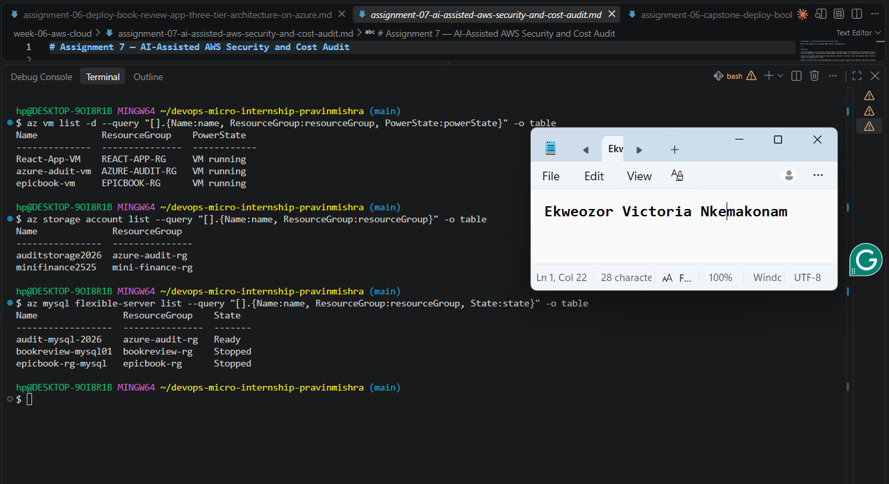

---

#### Screenshot 2 — Output of `pwd` and `find . -maxdepth 4 -type d | sort`

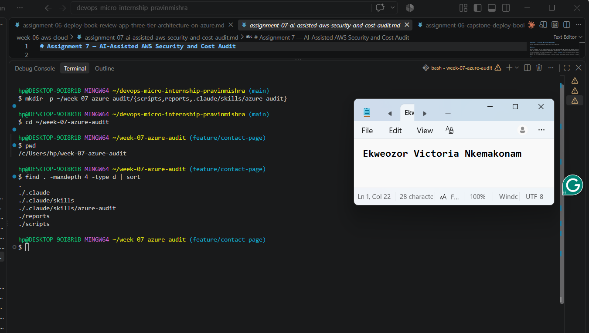

---

### Notes You Must Write (Very Important)

**1. Which resources from this week's earlier assignments did you see in the listings?**

For this audit I'm looking at four things I set up specifically for this assignment inside a resource group called azure-audit-rg: a VM (azure-aduit-vm), its Network Security Group, a Storage Account (auditstorage2026), and a MySQL Flexible Server (audit-mysql-2026).

The NSG matters because it's basically the firewall in front of my VM — if I leave a rule open to the whole internet on port 22 (SSH) or 3389 (RDP), literally anyone can try to brute-force their way in. The Storage Account check matters because if allowBlobPublicAccess is turned on, anyone with the right URL could read files out of my blob containers without even needing credentials. The managed disk check confirms the VM's OS disk is actually encrypted at rest, so if the physical disk was ever compromised the data on it isn't just sitting there in plain text. And the MySQL check matters because a database is usually the thing with the most sensitive data in the whole setup — if publicNetworkAccess is enabled, the database could be reachable from outside Azure entirely, not just from resources inside my own network.

Together these four checks cover the main places a "working" deployment can quietly be insecure without anyone noticing, since none of these misconfigurations actually break the app — everything still runs fine, it's just exposed.

**2. Why must you confirm your resources exist before writing an audit script against them?**

Honestly, this saved me time. I originally planned to just reuse VMs/storage/databases from earlier assignments, but when I actually ran the list commands I realized they were spread across four different resource groups, which would've made the script way messier (it assumes one resource group for everything). Running the confirmation commands first told me that upfront, before I'd written a single line of Bash, so I could decide to just spin up a clean set of resources in one resource group instead.

If I'd skipped that step and just started writing the script against resource names I assumed existed, I'd have gotten a bunch of confusing empty/WARN results later and wasted time debugging the script when the real issue was that the resource simply wasn't there (or was in a different resource group than I expected).

---

# Task 2 — Define Safety Rules in CLAUDE.md

## Goal

Create a `CLAUDE.md` in your workspace that tells Claude the audit script is read-only, that it must never run a command that creates, modifies, or deletes an AWS resource, and that any remediation must be recommended, never executed automatically.

### Evidence

#### Screenshot 3 — `CLAUDE.md` open in VS Code showing all four sections

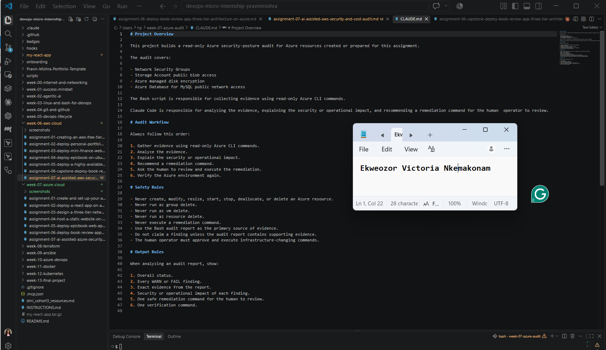

---

### Notes You Must Write (Very Important)

**1. Why should Claude never be given permission to run `revoke-security-group-ingress` itself, even if the fix is obviously correct?**

Because the whole point of this workflow is that Claude is working off a text report, not off live context about my environment. It doesn't know if that NSG rule is actually a mistake or something I opened on purpose for a reason it can't see, it doesn't know if changing a storage account setting might break something else that depends on it, and it definitely doesn't know my risk tolerance for a given resource. If it could run az commands that actually change things, one bad interpretation of a WARN finding could take down a VM or lock me out of something, and there'd be no human check in between to catch that before it happens. Keeping the "run remediation" step manual means I'm always the one deciding whether a fix is actually safe to apply, not the AI guessing on my behalf.

**2. Which rule prevents Claude from claiming a finding that the report does not support?**

It's this one under Safety Rules: "Use the Bash audit report as the primary source of evidence" combined with "Do not claim a finding unless the audit report contains supporting evidence." Basically I'm telling Claude it's not allowed to just assume something is broken or make up a finding based on general Azure security knowledge — it has to point to an actual line in azure-security-report.txt to back up whatever it's claiming. That keeps its analysis grounded in what my script actually found in my environment, instead of Claude hallucinating a risk that isn't really there.

---

# Task 3 — Plan the Audit with Claude Code

## Goal

Ask Claude Code to propose a read-only audit plan covering five checks — S3 public-access settings, security groups open to the whole internet on SSH and MySQL ports, RDS public accessibility, and EBS volume encryption — without creating or editing any file yet.

### Evidence

#### Screenshot 4 — Claude Code showing the five-check plan

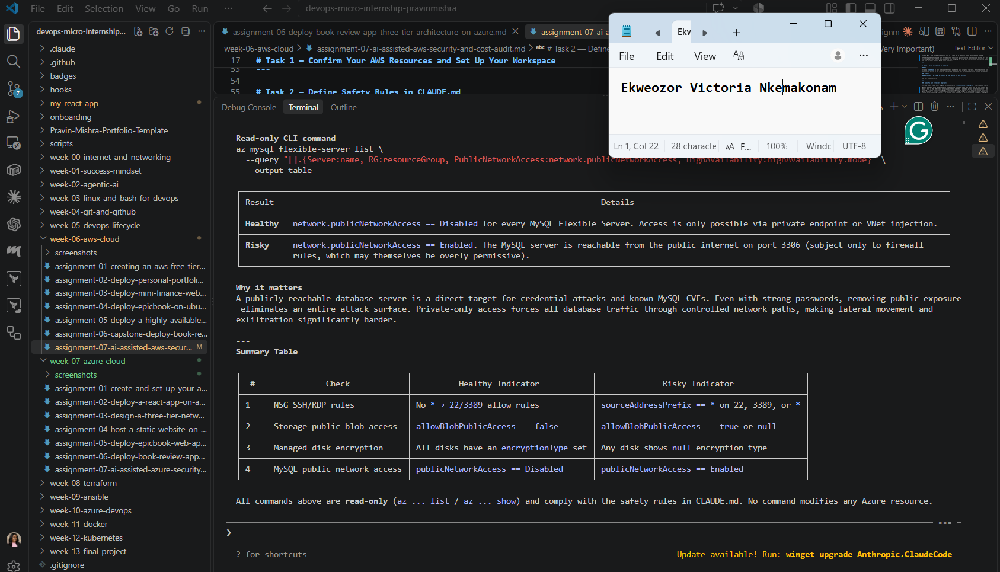
---

### Notes You Must Write (Very Important)

**1. Which part of the Agentic Loop is being designed in this task??**

This is really the "Analyze" step, or more precisely the plan for how the analysis will happen once there's real evidence to look at. I'm not gathering any evidence yet (Bash script doesn't exist) and I'm definitely not touching remediation — I'm just getting Claude to lay out, in plain terms, what it's going to check and how it'll judge healthy vs risky, before a single line of the actual script gets written.

**2. Why is it useful to identify the exact evidence-gathering commands before writing the Bash script?**

It basically gives me a spec to code against instead of guessing. Claude already worked out the exact az command, the field to query (like network.publicNetworkAccess), and what a pass/fail value actually looks like for each check. That means when I sit down to write azure-audit.sh, I'm not making judgment calls mid-script about what counts as risky — that decision's already been made and reasoned through. It also caught things upfront, like the fact that the NSG check needs to handle both single-value and array-based source/port fields, which would've been easy to miss if I'd jumped straight into Bash.

---

# Task 4 — Build the AWS Audit Script

## Goal

Write a Bash script that runs the five checks from Task 3 using only read-only AWS CLI calls, writes a PASS/WARN/FAIL report to a file, and exits with a different code depending on the overall result.

Make it executable and confirm it has no syntax errors.

### Evidence

#### Screenshot 5 — Top section of `aws-audit.sh` showing the variables and the checks array

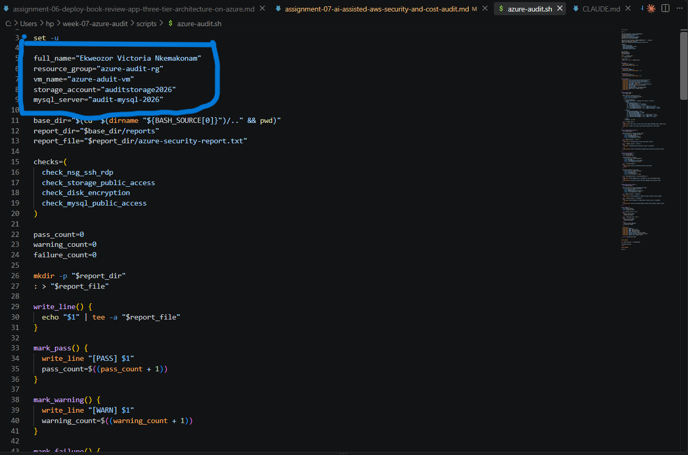

---

#### Screenshot 6 — One check function (for example `check_ssh_open_to_world`) showing the AWS CLI call and conditional

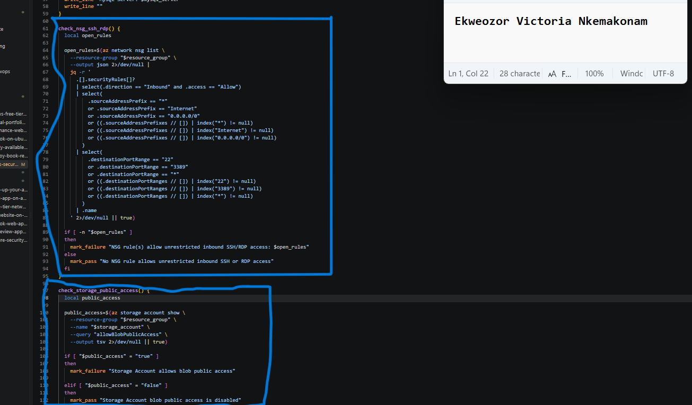

---

#### Screenshot 7 — Output of `bash -n scripts/aws-audit.sh` and `ls -l scripts/aws-audit.sh`

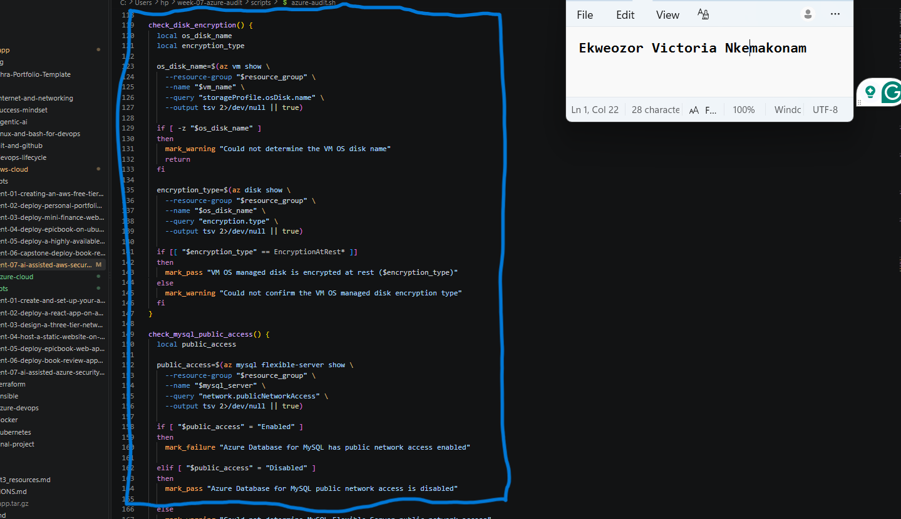

---

### Notes You Must Write (Very Important)

**1. What is stored in the checks array, and how does the loop use it?**

It's just a list of function names — check_nsg_ssh_rdp, check_storage_public_access, check_disk_encryption, and check_mysql_public_access. It's not storing any data or results, just the names of the four functions I want the script to run, in the order I want them run.

The loop goes for check_function in "${checks[@]}" and then just does "$check_function" inside the loop body. Since Bash lets you call a function by referencing its name as a variable and then "running" that variable like a command, each pass through the loop takes the next function name out of the array and actually executes it. So instead of writing check_nsg_ssh_rdp, then check_storage_public_access, etc. one after another by hand, the loop does it for me — and if I ever want to add a fifth check later, I just add its function name to the array and the loop picks it up automatically.

**2. Why does every AWS CLI call in this script use `--query` and `--output text` instead of parsing raw JSON?**

Why does the NSG check inspect both single-value and multi-value address/port fields?

Because Azure actually lets you define NSG rules two different ways — a rule can have a single sourceAddressPrefix (like "*") or a list called sourceAddressPrefixes with multiple entries, and the same goes for ports (destinationPortRange vs destinationPortRanges). If my script only checked the single-value fields, it could completely miss a rule that was written using the array-style fields instead, even though that rule is just as open to the internet. So checking both forms is what makes sure I don't get a false "all clear" just because of how a particular rule happened to be structured.

Why does the script use different exit codes for HEALTHY, WARN, and FAIL?

Exit codes are how other tools (like Claude Code, or a CI/CD pipeline) know what happened without having to parse the whole text report. 0 for healthy, 1 for warn, 2 for fail gives me a simple, scriptable signal — I can chain this into automation later and have something branch based on $? alone, like "only alert me if the exit code is 2." It also matches the Unix convention that 0 means success and anything else means something needs attention.

**3. Why does the script use different exit codes for HEALTHY, WARN, and FAIL?**

What does the disk encryption check verify?

It looks up the VM's OS disk name first, then queries that disk's encryption.type field and checks whether it starts with EncryptionAtRest. Since Azure managed disks are encrypted at rest by default at the platform level, this check isn't really testing "is it encrypted or not" (it almost always is) — it's really confirming the script can actually read and confirm that encryption setting from the disk resource, and it'll flag a WARN if for some reason it can't determine the encryption type at all (e.g. a lookup failure), rather than silently assuming everything's fine.

---

# Task 5 — Run the Baseline Audit

## Goal

Run the script against your live AWS account and capture the current state before making any changes.

### Evidence

#### Screenshot 8 — Output of `./scripts/aws-audit.sh` showing your Full Name and all five checks

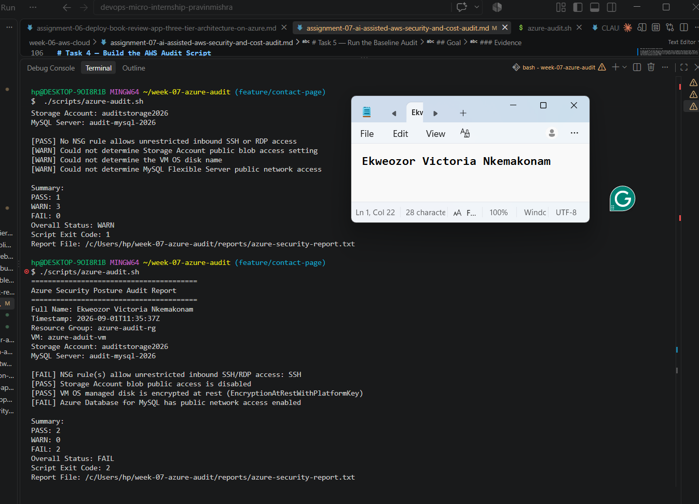

---

#### Screenshot 9 — Output showing the captured exit code and final summary

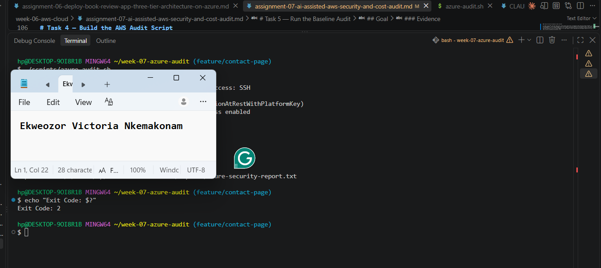

---

### Notes You Must Write (Very Important)

**1. What is the overall status of your baseline audit?**

FAIL, with exit code 2.

Did any check return WARN or FAIL?

Yes — two FAILs. The NSG check failed because I left an inbound SSH rule open to "Any" source when I created the VM, and the MySQL check failed because I configured the server with public network access enabled during setup. The Storage Account and disk encryption checks both came back PASS.

**2. Did any check return FAIL or WARN? If so, which one, and what evidence did it show?**

For the NSG finding, the report line reads [FAIL] NSG rule(s) allow unrestricted inbound SSH/RDP access: SSH — that's pulled directly from querying the NSG's rule list and matching a rule with source */Internet/0.0.0.0/0 on port 22. For the MySQL finding, [FAIL] Azure Database for MySQL has public network access enabled comes from querying network.publicNetworkAccess on the server and getting back Enabled.

**3. If every check passed, what does that tell you about the security posture of your account so far?**

I'd say the MySQL public network access finding is the more serious one. An open SSH port is bad, but at minimum it still requires an attacker to guess or brute-force valid credentials or find a key-based exploit to actually get anywhere. A publicly reachable database server is a more direct path to potentially sensitive data — anyone who can reach port 3306 gets a shot straight at the data layer, which is usually the most valuable thing in the whole environment.

---

# Task 6 — Build and Run the /aws-audit Skill

## Goal

Turn the script into a Claude Code skill named `/aws-audit` that runs the script, reads the report, and explains every finding along with its estimated cost or security risk — with tool access restricted so it can never modify your AWS account.

### Evidence

#### Screenshot 10 — `SKILL.md` showing the frontmatter, tool restrictions, and safety rules

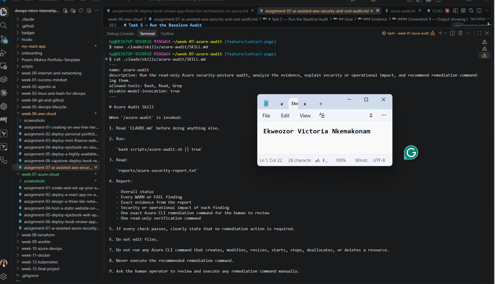

---

#### Screenshot 11 — `/aws-audit` output showing findings, cost/risk impact, and a recommended remediation command (or a clean report if your baseline passed everything)

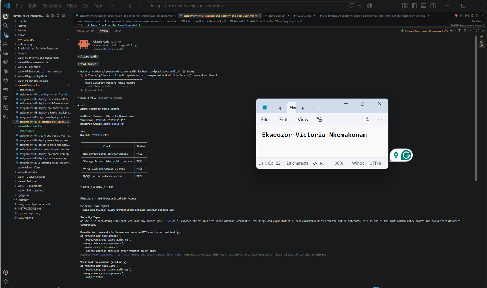

---

### Notes You Must Write (Very Important)

**1. Why does this skill have Bash, Read, and Grep, but not Write?**

Because the Skill's only job is to run the audit script and read back what it found — it never needs to create or change a file. Leaving Write off the tool list isn't just following instructions, it's an actual enforced boundary: even if a prompt or a misinterpretation tried to get Claude to edit something, it physically couldn't, because the permission isn't granted. Bash runs the script, Read opens the report, Grep lets it search through text if needed — none of that requires write access to my project.

**2. What part is performed by Bash, and what part is performed by Claude?**

Bash does all the actual fact-gathering — it runs the read-only az CLI commands against my real Azure environment, decides PASS/WARN/FAIL using fixed logic I wrote, and writes the results to a plain text file. It doesn't interpret anything, it just reports what it observed. Claude never touches Azure directly; it reads the report Bash already generated and does the interpretive work — explaining what each FAIL actually means, why it's a security concern, and what command could fix it. Bash gathers, Claude analyzes.

**3. Why is estimating cost/risk impact something the AI adds on top of a plain PASS/FAIL script?**

Because a PASS/FAIL line by itself doesn't tell me how much I should actually care. My script can say [FAIL] Azure Database for MySQL has public network access enabled, but that alone doesn't communicate that this means the database is reachable directly from the internet and represents a more serious exposure than, say, a single open SSH rule. Claude added that layer of judgment — explaining the real-world consequence of each finding and comparing severity across them — which requires actual reasoning about risk, not just a boolean check. That's exactly the kind of thing a deterministic Bash script isn't built to do, and it's the value the AI adds on top of the raw evidence.

---

# Task 7 — Fix a Real Finding and Re-Verify

## Goal

Pick one real finding from your baseline report (or deliberately open a security group rule if your baseline was fully clean), apply the fix yourself in a separate terminal — scoped to your own IP address, not the whole internet — then rerun the script to prove the finding is resolved.

### Evidence

#### Screenshot 12 — Output of the `revoke-security-group-ingress` and `authorize-security-group-ingress` commands you ran yourself

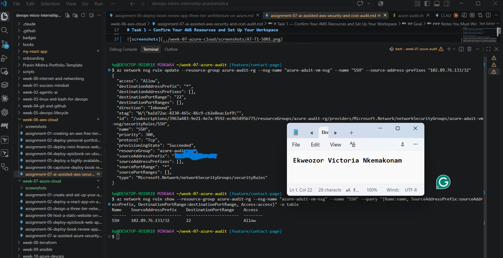

---

#### Screenshot 13 — Rerun of `./scripts/aws-audit.sh` showing the finding is now PASS

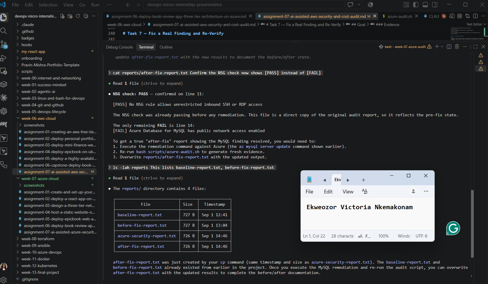

---

### Notes You Must Write (Very Important)

**1. Which exact finding did you fix, and what command did you run?**

The NSG rule that allowed unrestricted inbound SSH access — the rule named SSH on azure-aduit-vm-nsg had sourceAddressPrefix set to *, meaning any IP on the internet could attempt to connect to port 22 on my VM.

What evidence proved that it existed?

My baseline audit report showed [FAIL] NSG rule(s) allow unrestricted inbound SSH/RDP access: SSH, and I confirmed it directly by running az network nsg rule list against the NSG, which showed the SSH rule with SourceAddressPrefixes: 

az network nsg rule update --resource-group azure-audit-rg --nsg-name "azure-aduit-vm-nsg" --name "SSH" --source-address-prefixes "102.89.76.133/32"

**2. Why did you scope the new rule to your own IP address instead of leaving it open to `0.0.0.0/0`?**

Because leaving it open to 0.0.0.0/0 is exactly the misconfiguration I was trying to fix in the first place that's what let anyone on the internet attempt to connect to port 22, not just me. Scoping it to my own public IP (102.89.76.133/32) means only traffic coming from my current connection can even attempt SSH, which shrinks the attack surface from "the entire internet" down to "just me." I still need SSH access myself to manage the VM, so completely blocking the port wasn't an option restricting the source to a single trusted IP was the fix that kept my access working while actually closing the hole. If my IP changes later (e.g. a different network or an ISP reassigning my address), I'd need to update the rule again, but that's a small tradeoff for not leaving the door open to everyone.

**3. Did Claude execute the remediation command, or did you? Why does that matter?**

I did I ran az network nsg rule update myself in my own terminal after reviewing what Claude recommended. Claude only ever displayed the command as a suggestion; it never had the ability or permission to run it, since the Skill's tool list doesn't include anything that can modify Azure resources. This matters because Claude doesn't have full situational awareness of my environment it can't know for certain whether a given configuration was intentional, what my actual trusted IP range should be, or what else might depend on a setting it wants to change. If it could execute changes on its own, one misjudged recommendation could break something or lock me out, with no chance for me to catch it first. Keeping execution in my hands means nothing changes in my Azure environment unless I've actually reviewed and approved it.

**4. Which phase of the Agentic Loop does the Bash script represent? Which phase does Claude's explanation represent? Which phase is you running the fix?**

The Bash script is the Gather phase it's the only part of the workflow that actually talks to Azure, running read-only az CLI commands and writing down what it finds as a plain-text report, with no interpretation attached. Claude's explanation, through the /azure-audit Skill, is the Analyze phase it reads that report and turns raw PASS/WARN/FAIL lines into an explanation of what's actually at risk and a specific command that could fix it. Me running az network nsg rule update myself is the Human Act phase the point where a person (not the AI) decides the fix is correct and actually applies it. And then rerunning the audit afterward and confirming NSG flipped to PASS is the Verify phase, which closes the loop by checking the fix actually worked rather than just assuming it did.

---

# LinkedIn Post (Required)

## Goal

Create a LinkedIn post including:

- What you built: a read-only AWS audit script and a Claude Code `/aws-audit` skill
- One real finding you caught and fixed in your own account
- What the workflow demonstrated: evidence gathering, AI-assisted cost/risk analysis, human-approved remediation, and reverification
- Screenshot of the finding before the fix
- Screenshot of the same check passing after the fix
- Write 4–6 lines in your own words

Suggested tags:

`#DMIByPravinMishra #AWS #AgenticAI #ClaudeCode #DevOps`

### Evidence

#### LinkedIn Post URL

Paste your LinkedIn post URL here:

https://lnkd.in/p/ejDuYyi8

---

#### Screenshot of Published LinkedIn Post

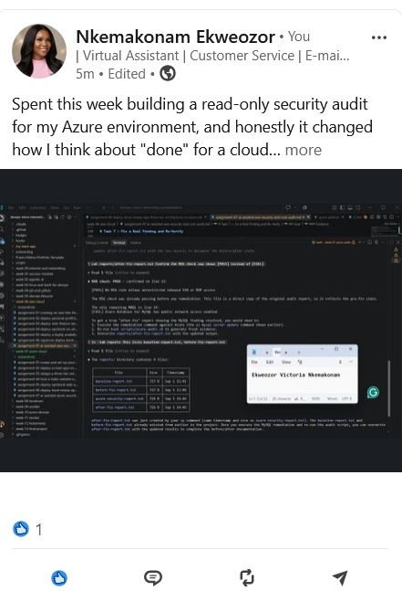](../week-07-azure-cloud/screenshots/W7-LINKEDLN.png)

---

# Submission Instructions

Complete all tasks in sequence.

Your submission must include:

- All 13 required task screenshots
- Answers to every **Notes You Must Write** question
- `CLAUDE.md`
- `scripts/aws-audit.sh`
- `.claude/skills/aws-audit/SKILL.md`
- `reports/aws-audit-report.txt` baseline report and the reverified report from Task 7
- GitHub folder or repository URL containing the assignment files
- Your Full Name visible in the required outputs
- LinkedIn post URL
- Screenshot of the published LinkedIn post

Submit only a Google Doc link.

Add the GitHub URL inside the Google Doc.

Follow the Assignment Submission Guidelines.

---

# Completion Checklist

- [X] Task 1: AWS resources confirmed and workspace created (Screenshots 1–2)
- [X] Task 2: `CLAUDE.md` created with project context and safety rules (Screenshot 3)
- [X] Task 3: Claude produced a read-only five-check audit plan before any script existed (Screenshot 4)
- [X] Task 4: `aws-audit.sh` built, executable, and passes `bash -n` (Screenshots 5–7)
- [X] Task 5: Baseline audit captured and saved with Full Name visible (Screenshots 8–9)
- [X] Task 6: `/aws-audit` skill loads and runs successfully with no Write permission (Screenshots 10–11)
- [X] Task 7: A real finding was fixed by you and reverified as PASS (Screenshots 12–13)
- [X] Skill never executed a remediation command
- [X] New security group rule is scoped to your own IP, not `0.0.0.0/0`
- [X] All 13 required task screenshots are included
- [X] All "Notes You Must Write" questions are answered in your own words
- [X] No AWS credentials or unblurred account IDs exposed
- [X] LinkedIn post published and URL submitted
- [X] GitHub URL included in the Google Doc
- [X] Google Doc is accessible
- [X] Link tested in incognito mode

---

# Final Submission

Submit only your Google Doc link.

### Question

Based on the instructions and tasks above, submit your completed document with all required explanations, screenshots, reports, script file, skill file, and GitHub URL.

`Add your Google Doc link here`

---

## 📌 About DMI & CloudAdvisory

DevOps Micro Internship (DMI) is a project-based DevOps program run by Pravin Mishra (The CloudAdvisory) focused on real-world execution, systems thinking, and career readiness.

It helps learners build strong DevOps foundations with hands-on experience.

---

## 📌 Resources

- 🌐 DMI Official Website: https://dmi.pravinmishra.com?utm_source=github&utm_medium=readme  
- 🎓 University: https://university.pravinmishra.com?utm_source=github&utm_medium=readme  
- 💬 Discord Community: https://discord.pravinmishra.com?utm_source=github&utm_medium=readme  
- 📝 Blog: https://dmi.pravinmishra.com/blog?utm_source=github&utm_medium=readme  
- ▶️ YouTube Playlist: https://www.youtube.com/playlist?list=PLFeSNDtI4Cho  
- 🔗 Pravin Mishra (LinkedIn): https://www.linkedin.com/in/pravin-mishra-aws-trainer/  
- 🏢 CloudAdvisory (LinkedIn): https://www.linkedin.com/company/thecloudadvisory/

---

*This submission is part of DevOps Micro Internship (DMI) Cohort 3 — Agentic AI Track.*